# "공포의 중심에서 매수 버튼을 눌러라" — 역발상 투자전략

> **출처**: 한경 BUSINESS 2026.06.10–16 커버스토리 · 박세익 체슬리투자자문 대표 (기자 김영은)
> **구성**: Part 1 잡지 요약 · Part 2 데이터 검증 · Part 3 한계
> **검증 기준일**: 2026-06-16 (Yahoo Finance·stockanalysis.com·HYG 프록시)

---

# Part 1. 잡지 내용 요약

## 들어가며 — "가장 큰 적은 시장이 아니라 감정"

- 미·이란 전쟁 후 글로벌 증시 폭등·폭락 반복. 상반기 2배 급등한 코스피, 하반기 시험대.
- 박세익 대표의 처방: **공포의 정점에서 매수**. 변동성 클수록 **'하락 시 매수, 반등 시 매도'** 역발상.
- 공포에 팔고 꼭대기에서 사는 행동 차단 → **코어 앤 새틀라이트 전략**으로 5년 이상 주도할 **구조적 성장주**에 탑승.

## 1. 코어 앤 새틀라이트

- **코어(핵심) 65~85%**: 장기 구조적 성장주에 묻어두기
- **새틀라이트(위성) 15~35%**: 시장 따라 기동성 운용

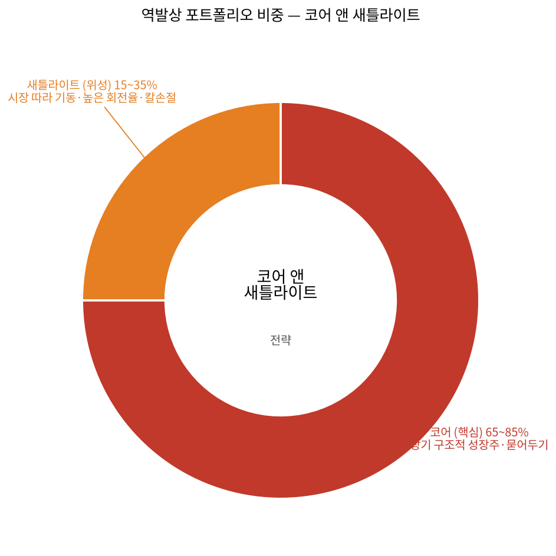

### 코어 3대 기준
1. **구조적 성장 5년+ 지속** — 단기 경기 사이클에 둔감한 업종. 현재 AI·반도체·전력 인프라·조선·방산.
2. **해자(MOAT)** — 삼성·SK하이닉스 반도체 적층, HD한국조선해양 LNG선, 한화에어로 K9. *"해자가 있어야 경쟁이 심해져도 독보적 수익성 유지."*
3. **합리적 밸류에이션** — *"역사적 PER·PBR 대비 과도한 고평가 종목은 코어 비중 축소."*

→ 세 조건 충족 시 조정장에서 **기관·외국인 저가 매수세 유입 → 하방 지지력**.

### 새틀라이트(기동대) 3원칙
- **이벤트**(실적·정책·선거) · **순환매**(돈의 길목) · **모멘텀**(수급·실적 상향)
- 핵심: **높은 회전율 + 칼 같은 손절**. *"손실이 나도 코어는 무너뜨리지 않는 것이 핵심."*

## 2. 공포에 담을 4대 산업

- **① 전력 인프라** — 경기 종속 → AI 인프라 필수재로 체질 전환. 변압기·케이블 공급 부족, 인도까지 2~3년. HD현대일렉트릭·효성중공업 고마진 선별 수주. *"수년 치 매출·역대급 이익률이 이미 장부에 확정."*
- **② 조선** — 20년 만의 최강 호황. 지정학·환경규제발 강제 교체 수요. 대형 3사 도크 3~4년 치 예약. 미 국방부 MRO + IMO 친환경선 기술서 *"한국이 중국 압도."*
- **③ 피지컬 AI** — 주목 종목 **현대차**. 보스턴다이내믹스 보유에도 PER 10배 안팎 극단 저평가.
- **④ 방산** — 신냉전발 수출 주도 성장주. 해자 = **압도적 납기**. *"무기 라인 365일 풀가동 세계 유일국."* 록인 효과·수주잔고 5~10년 치.

> **4대 산업 관련 종목 주가 (최근 1년, 1년전=100 리베이스)**

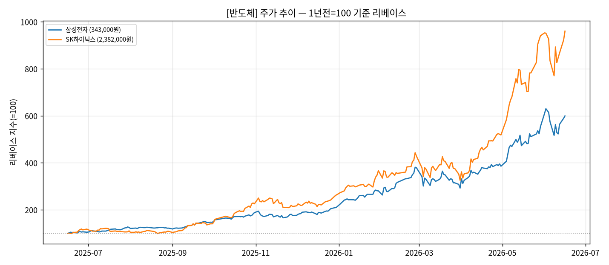
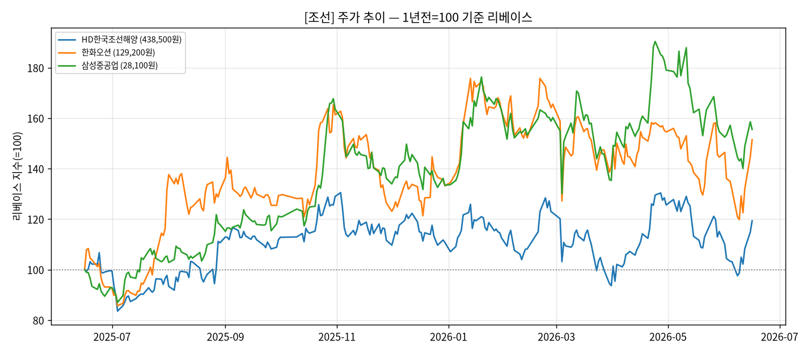
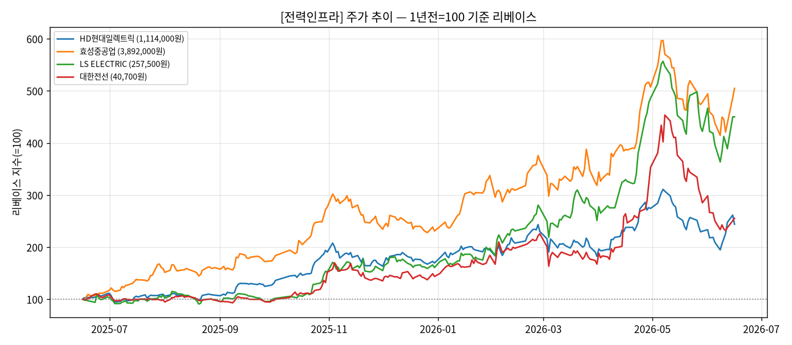
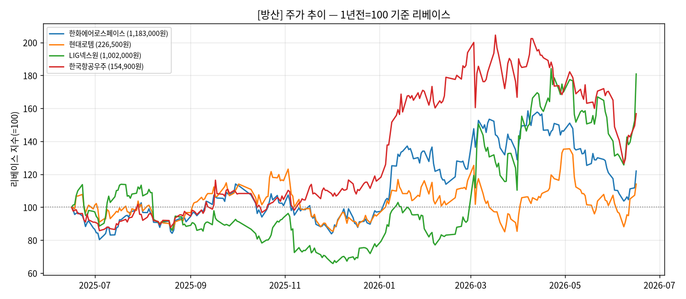
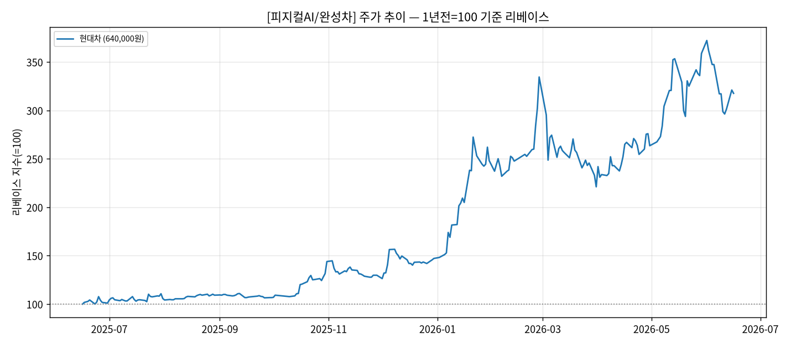

## 3. 실전 기술 — "반도체 계속 가나? 두 가지만 확인하라"

- **분할매수** — 바닥은 못 잡음. 목표금액 분할 매수로 평단 관리. 예) 삼성전자 1억: 현재가 1차(2,500만), −5% 2차, −10% 3차, −15% 4차. 하락폭 클수록 평단↓·회복 시 수익 극대화.
- **물타기 경계** — 펀더멘털 훼손 아니면(삼성 HBM 수요·SK하이닉스 기술우위 건재) 분할매수 합리적. **근본 경쟁력 붕괴면 분할매수 아닌 손절.** 이 판단이 핵심 역량.
- **하반기 키워드 = '차별화 심화'** — 유동성 장세 종료. 실력주 vs 무늬주 격차 확대. 반도체 체크 2가지: ① 미 빅테크 CAPEX 집행 ② 삼성·SK 분기 가이던스 유지. 잡음 시 순환매 시작. 전력·조선은 눈높이 최고조 → 실적·수주로 증명해야 추가 상승.

## 4. 가장 강력한 매수 신호 — 3대 지표

1. **VIX(공포지수)** — 25↑ 공포 확산, 30↑ 극도 공포. *"VIX 30↑ 매수자는 이후 1년 평균 고수익."*
2. **HY 스프레드** — 하이일드 금리 − 국채 금리. 확대=신용위험↑, 안정·축소=정상화·회복. *"3월 빠른 안정이 4월 반등 신호."*
3. **외국인 순매수** — 조정장 매수 증가=하방 지지, 외국인마저 매도=추가 하락 위험.

> **"세 지표가 동시에 충족되는 시점이 가장 강력한 역발상 매수 신호."**

> **3대 지표 최근 1년 추이**

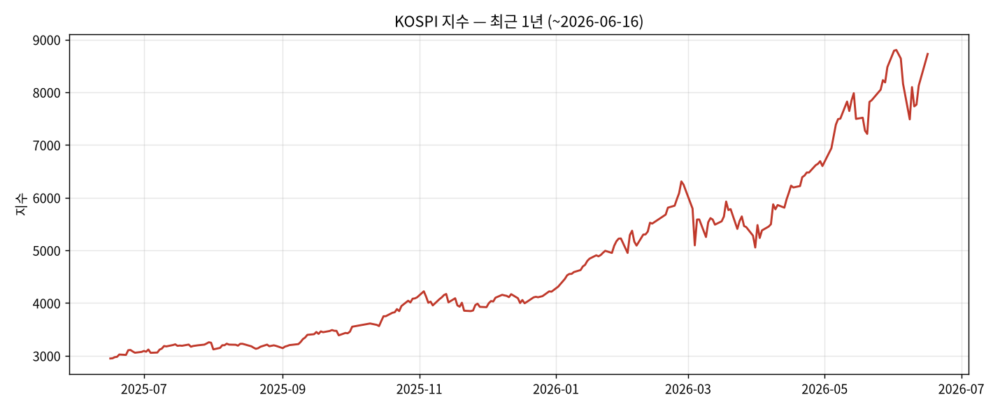
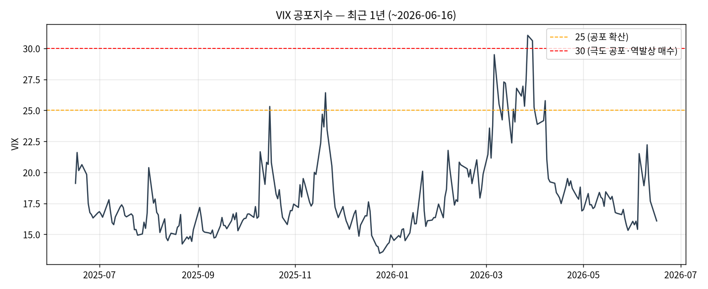
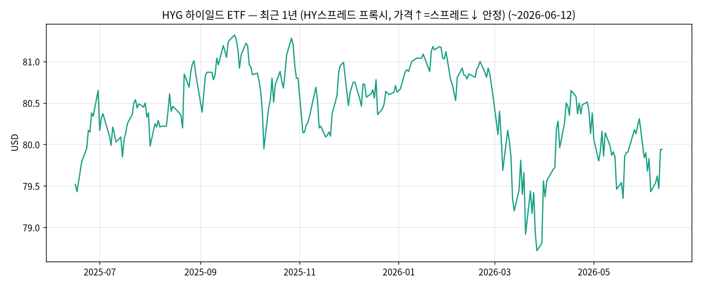

---

# Part 2. 데이터 검증

지난 1년(2025-06~2026-06) 실데이터 검증. 수익률 = 5종목 동일가중 (각 종목 매도가÷매수가의 평균 −1), 배당·세금·수수료 제외.

### 검증 1 — 신호는 실제 발생했나? ✅
- **VIX 30 돌파(연중 최고 31.0)·HY 최대 신용공포(−3.2%) 모두 2026-03-27.** (VIX·HY스프레드 동행성은 검증 3 참조)
- "세 지표 동시 충족"이 3월 말 실제 발생, 그 지점이 거의 정확히 **단기 저점**.

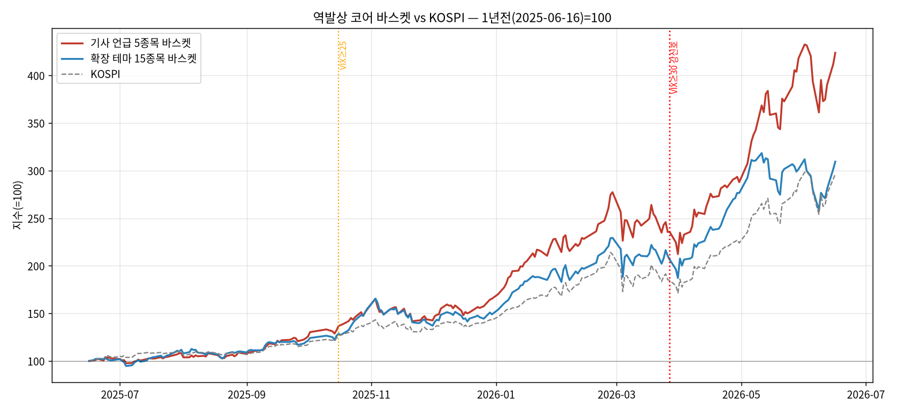

### 검증 2 — 매수·매도 타이밍 (★ 핵심)
공포에 사는 것, 그리고 **언제 파느냐**에 따라 결과가 완전히 달라진다. 세 가지 방식으로 검증.

**2-A. 현재까지 보유했다면 (buy & hold, 매도일=2026-06-16)**

| 행동 (3월 공포국면 현금 투입) | 수익률 |
|------|---:|
| 고점 일괄매수 (최악 타이밍) | +34.9% |
| 분할매수 (고점→저점 4회) | +50.5% |
| **VIX≥30 신호 매수** (공포 정점) | **+56.2%** |
| 저점 일괄매수 (사후 이상치) | +73.2% |

- 또한 패닉셀(3월 매도 후 현금) **+135.5%** vs 끝까지 보유 **+323.8%** → 공포 매도자는 약 **188%p 상실**.
- ⚠️ **단, 이 수익엔 강세장 '보유기간 효과'가 섞여 있다.** 신호 자체의 힘은 2-B·2-C에서 분리 검증.

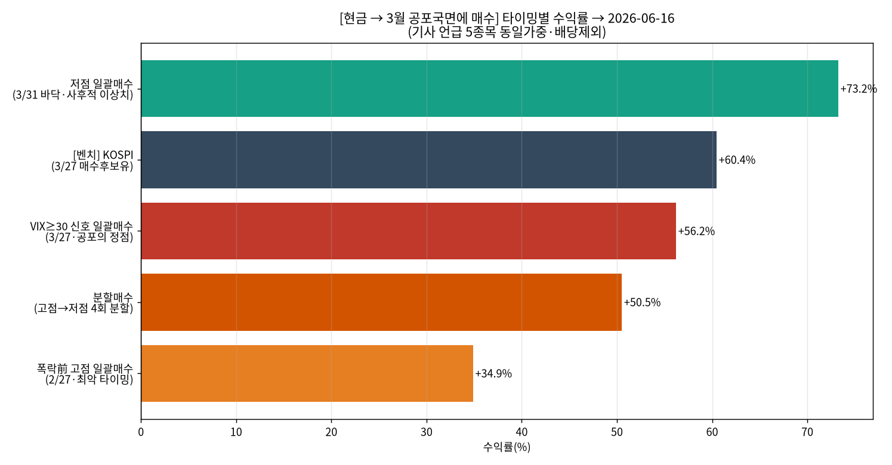
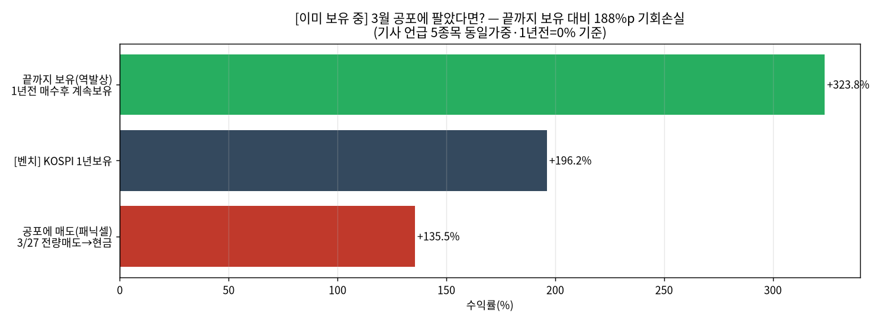

**2-B. 반등 시 매도(왕복매매) — 기사 취지 충실**
- 규칙: 매수 = VIX 임계 상향돌파 종가 / 매도 = 이후 **VIX<20(정상화)** 첫 종가.

| 전략 | 매매 | 결과 |
|------|---|---:|
| 매수 VIX≥25 → 매도 VIX<20 | 3회 왕복(4·5·34일) | 누적 **−1.9%** |
| 매수 VIX≥30 → 매도 VIX<20 | 1회(13일) | **+6.3%** |
| (벤치) 1년 buy & hold | — | +323.8% |

→ **반등 때 실제로 팔면 단기 edge는 −2~+6%로 거의 소멸.** 앞선 +56~324%는 '신호'가 아니라 '보유기간'의 힘이었다.

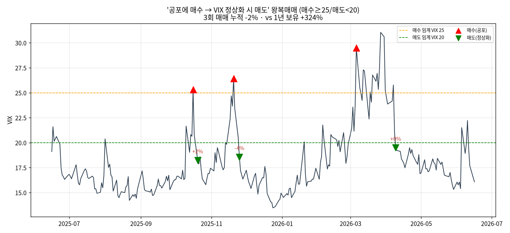

**2-C. 종목별 — 공포에 산 케이스 vs 공포에 판 케이스**
- 공포구간 = VIX 25 돌파 ~ 20 회복 (1년 3회). ① 공포매수=공포구간만 보유 / ② 공포매도=공포 회피·평소만 보유.

| 종목 | ① 공포매수 | ② 공포매도 | 참고: 1년 보유 |
|------|---:|---:|---:|
| 삼성전자 | **+7.4%** | +458% | +500% |
| SK하이닉스 | **+5.3%** | +812% | +860% |
| HD한국조선해양 | **−5.5%** | +26% | +19% |
| 한화에어로스페이스 | **−6.5%** | +30% | +22% |
| 현대차 | **−10.8%** | +256% | +218% |
| **바스켓(평균)** | **−2.0%** | +317% | +324% |

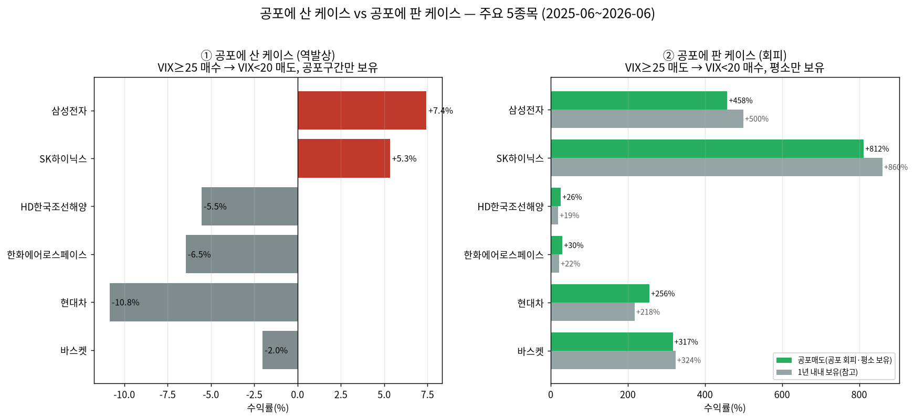

→ **공포 타이밍 자체로는 거의 못 벌었다**(① −11~+7%). **돈은 전부 '평소(비공포) 구간'에서 발생**(②). 조선·한화·현대차는 공포 회피가 1년 보유보다 우월. 큰 수익은 "공포에 산 효과"가 아니라 **"구조적 성장주를 안 팔고 오래 보유한 효과"**.

### 검증 3 — VIX≥25 신호 7회 × 종목 평균 (신호일→6/16, 보유)
| 종목 | 평균 | 비고 |
|------|---:|------|
| SK하이닉스 | **+211%** | 전 신호 1위 |
| 삼성전자 | +124% | 반도체 강세 |
| 현대차 | +61% | |
| HD한국조선해양 | +6% | 선반영·횡보 |
| 한화에어로스페이스 | **−5%** | 3월 신호선 −10~−23% |
| **바스켓 +80%** vs **KOSPI +74%** | | |

→ "주요 주식"도 차별화. **종목·진입시점이 신호보다 중요.** 초과수익 대부분은 반도체 2종목.

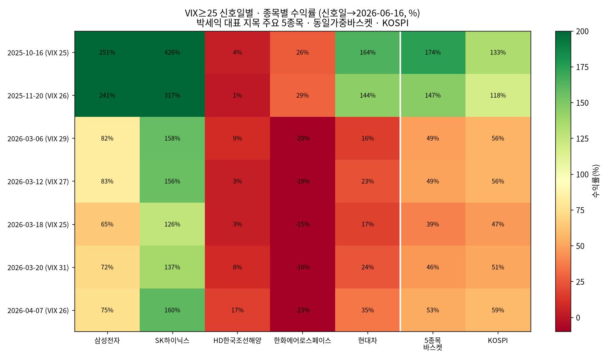
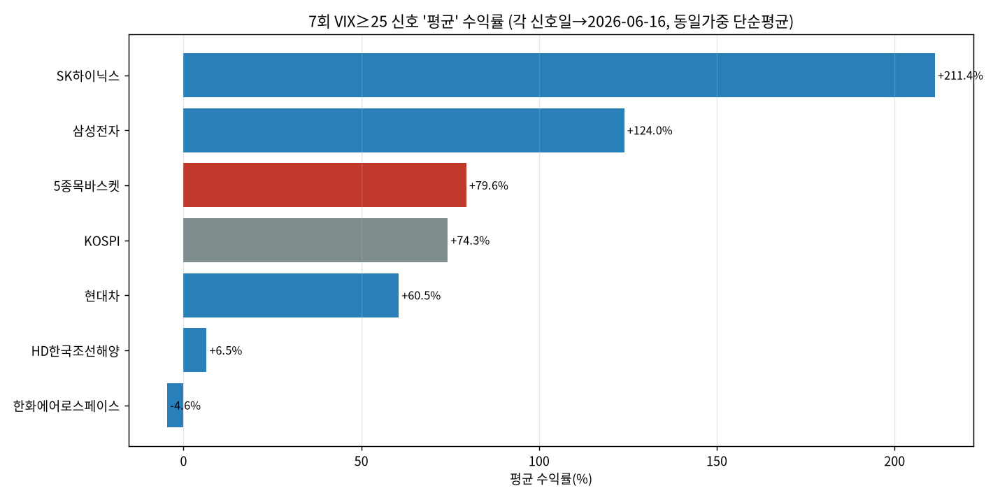

### 검증 4 — VIX vs HY스프레드 상관
- 수준·일간변화 모두 **Pearson +0.63**, Spearman +0.51.
- **리드-래그 없음**(lag 0일 최강) → 예측 아닌 **동행·상호확인** 지표. (∴ 두 신호는 사실상 같은 사건을 가리킴)
- 위기 시 동조 강화: 3월 롤링상관 +0.7~0.8.

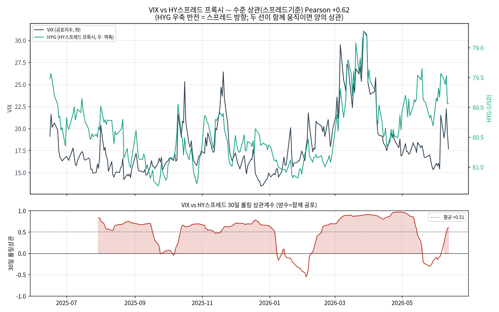
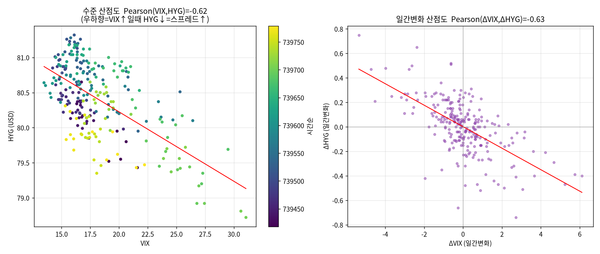

### 검증 5 — 밸류에이션 스냅샷
- **저평가(코어 적합)**: 현대차 PER 20.9·PBR 1.1, HD한국조선해양 PER 12.3·PBR 1.8.
- **고평가(선반영)**: HD현대일렉트릭 PBR 20.6, LS ELECTRIC PER 113, 효성중공업 PER 72.

→ 현대차·조선 저평가, 전력기기 고밸류. 기사의 "전력·조선 눈높이 최고조" 경고와 일치.

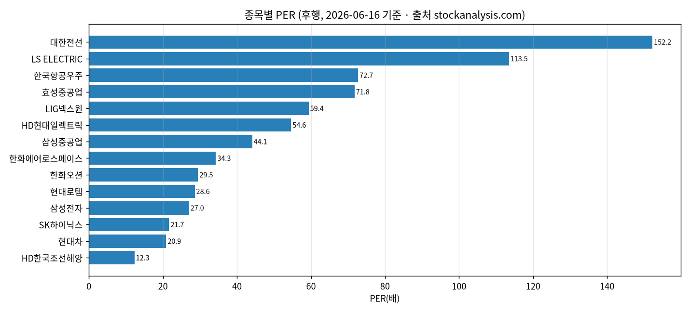
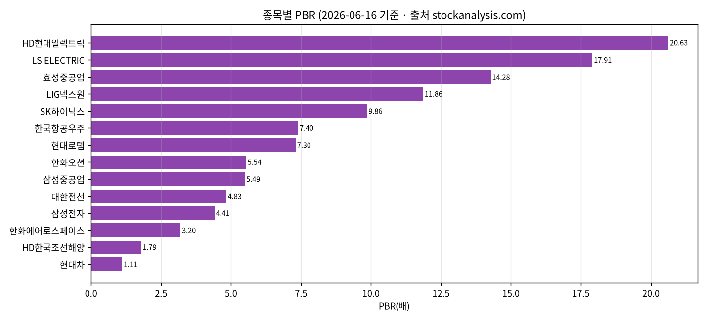

---

# Part 3. 한계

- **생존편향** — 기사가 이미 승자로 지목한 종목. 사후 선정 표본.
- **초강세장** — KOSPI 2배 구간. 거의 모든 진입 이익, 공포매수도 KOSPI(+60%) 미추월. 약세장선 결과 상이 가능.
- **짧은 검증기간** — 3월 신호 후 2~3개월. "VIX 30 매수 후 1년 수익" 미검증.
- **수익의 출처 = 보유기간** — 검증 2-B대로 반등 시 매도하면 단기 edge는 −2~+6%로 소멸. 큰 수익은 타이밍이 아닌 장기 보유(강세장)에서 발생.
- **HY는 프록시** — 실제 OAS(FRED) 아닌 HYG ETF(금리 영향 포함).
- **외국인 순매수 미검증** — 데이터 소스 부재.
- 배당·세금·비용 제외, 동일가중. **교육·기록용, 투자 권유 아님.**

---

*데이터·스크립트: `analysis/` (fetch_and_plot.py, backtest.py, vix25_analysis.py, roundtrip_backtest.py, fear_buy_vs_sell.py, correlation_analysis.py) · 차트·원자료 CSV.*
