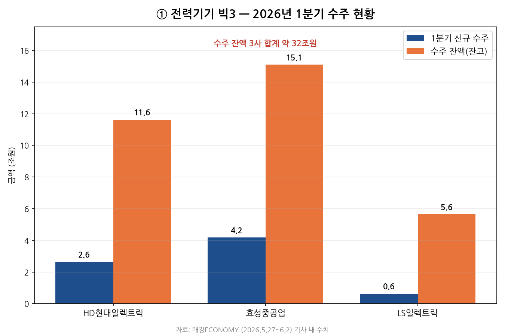
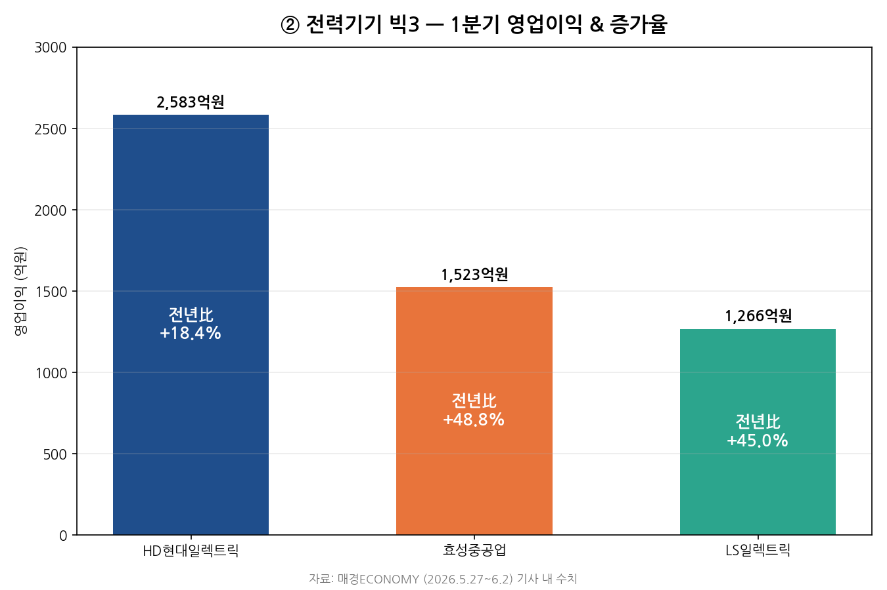
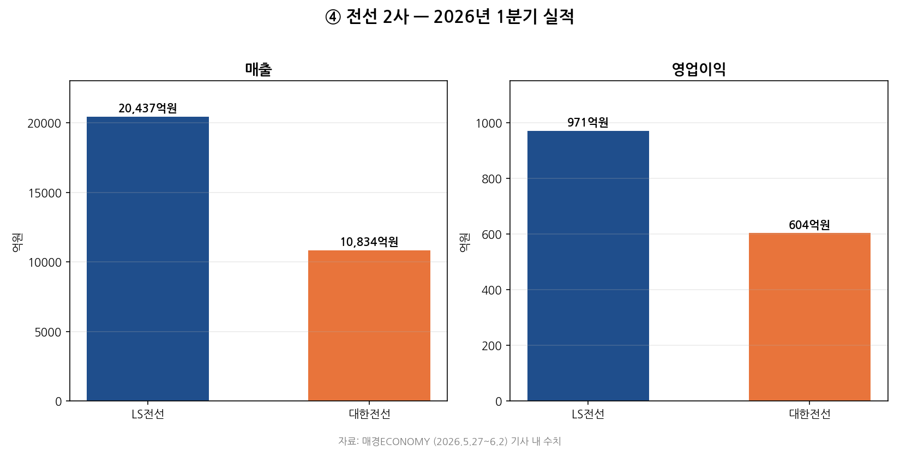
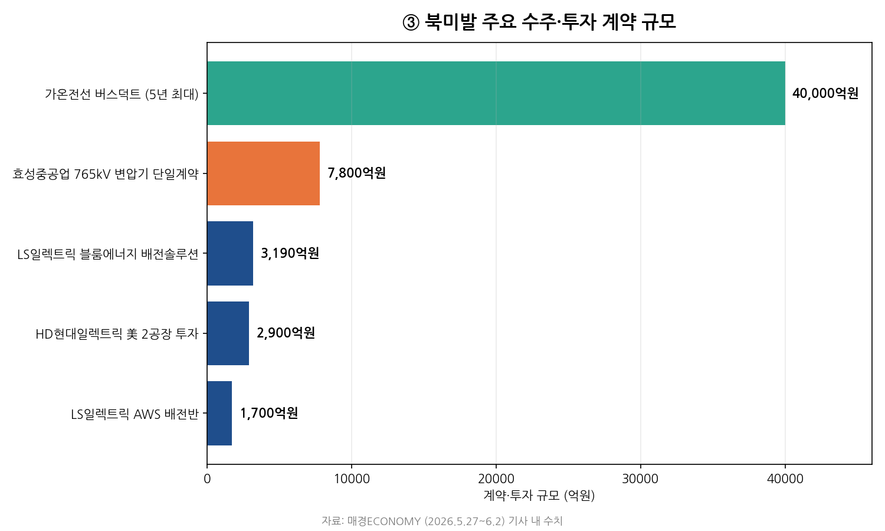
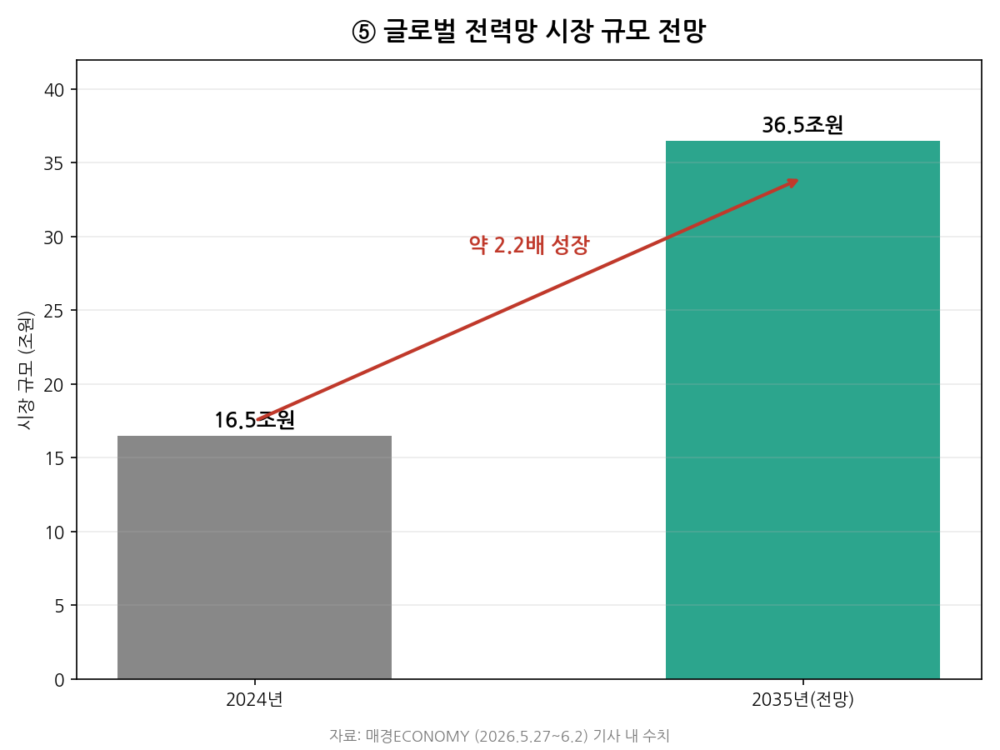
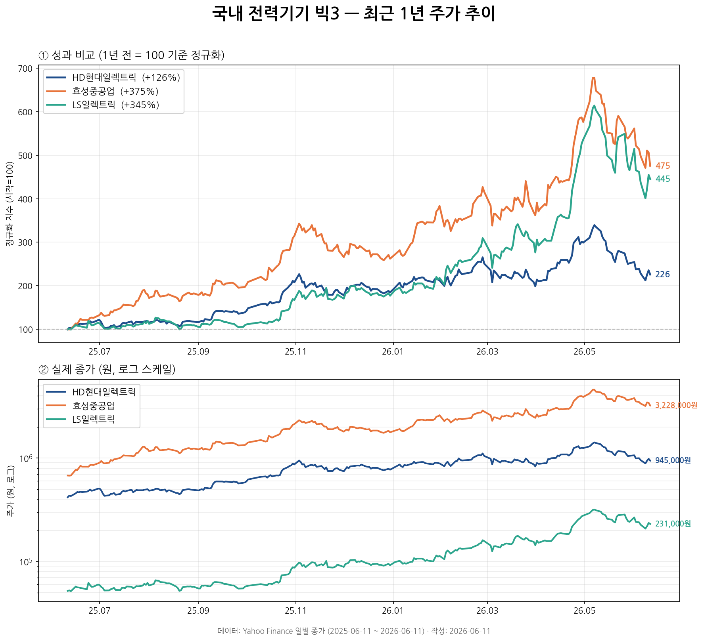
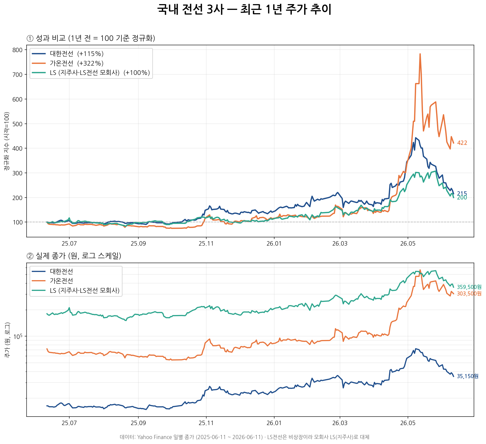

*(매경ECONOMY 2026.5.27~6.2 · 커버스토리 · 김경민 기자)*

## 한 줄 요약

> AI 데이터센터가 폭발적으로 늘면서, 전기를 만들고 나르는 **한국 전력기기·전선 업체에 일감이 쏟아진다.** 미국 빅테크가 "K전력기기 빨리 달라"며 속을 태우는 중.

## 1. 한국 전력기기 빅3, 사상 최대 호황

- HD현대일렉트릭·효성중공업·LS일렉트릭 3사의 1분기 **수주 잔액 합계 약 32조원**
- HD현대일렉트릭: 1분기 만에 연간 목표의 **43%** 달성, 수주 잔액 사상 최대치 경신
- 효성중공업: 한국 역대 최대인 **7,800억원 단일 계약**(765kV 변압기) 수주
- LS일렉트릭: 데이터센터 내부용 제품 강자, **아마존(AWS)·블룸에너지** 계약 잇따라 수주

영업이익도 나란히 급증했다. 특히 효성중공업과 LS일렉트릭은 전년 대비 40%대 성장을 기록했다.

## 2. 주문 밀려들자 '공장 증설·건설' 경쟁

일감이 넘치자 빅3가 생산능력 확대에 안간힘을 쓰는 중이다.

| 기업 | 공장 증설·건설 내용 |
| --- | --- |
| HD현대일렉트릭 | 미국 앨라배마 몽고메리시에 **2억달러(약 2,900억원)** 투자, 초고압 변압기 **2공장 건설 중**. 국내 울산공장도 내년 말 완공 목표로 증설 |
| 효성중공업 | 북미 거점 **미국 멤피스공장을 2028년까지 증설**해 생산능력 **50% 이상 확대** 계획 → 중공업 부문 영업이익률 17%→**24%** 전망 |
| LS일렉트릭 | 미국 텍사스주 배스트럽시에 **'배스트럽 캠퍼스' 준공** — 생산+R&D+AS를 합친 북미 전력 솔루션 허브 |

## 3. 전선 업체도 동반 호황

- LS전선·대한전선 모두 분기 최고 실적
- 가온전선: 미국 AI 데이터센터에 '전력 고속도로' **버스덕트**를 향후 5년 최대 **4조원** 규모 공급 (업계 역대 최대 계약)

> 가온전선 버스덕트는 5년 누적 최대치라 다른 단일·연간 계약과 기간 기준이 다르다.

## 4. 호황의 3가지 이유

1. **AI 데이터센터 급증** — 막대한 전력 수요로 초고압 전력망 필요 (전 세계 대형 데이터센터 전력 사용량 67.7GW, 전년比 +15%)
2. **노후 전력망 교체** — 미국 송전선 70%가 25년 초과, EU 배전망 40%가 40년 초과
3. **중국산 퇴출 반사이익** — EU가 안보 우려로 중국산 인버터 사용 금지 → 한국 업체로 주문 집중

글로벌 전력망 시장 자체가 빠르게 커지는 점도 구조적 호재다.

## 5. 결론

글로벌 전력망이 **가격이 아닌 안보·신뢰성 중심**으로 재편되며, 중국을 뺀 최강 제조 경쟁력의 **한국 기업이 최대 수혜자**가 될 전망이다. 이에 빅3는 미국 현지 생산기지 확충으로 장기 수요에 미리 대비하고 있다.

## 6. 관련 기업 주가 (최근 1년)

기사 속 호황이 실제 주가에 어떻게 반영됐는지 살펴봤다. (자료: Yahoo Finance 일별 종가, 2025-06-11 ~ 2026-06-11)

**전력기기 빅3** — 세 종목 모두 2~4배 급등했다가 2026년 5월 고점 후 조정.

**전선 3사** — 가온전선이 버스덕트 호재로 가장 극적으로 상승. (LS전선은 비상장이라 모회사 LS(006260)로 대체)

## 7. 용어 정리 (클릭하면 펼쳐집니다)

발표 중 나온 핵심 용어를 쉽게 풀어 정리했다.

<strong>수주 잔액(수주 잔고)이란?</strong>

이미 계약은 따냈지만 **아직 납품하지 않아 앞으로 매출로 잡힐 일감**의 총액. 식당으로 치면 "주문은 받았지만 아직 안 만들어 준 음식의 총합"이다. 전력기기처럼 납품까지 2~3년 걸리는 산업에서 **미래 실적의 안정성**을 보여주는 핵심 지표다.

<strong>초고압 변압기란?</strong>

**전기의 압력(전압)을 확 높였다가 다시 낮추는 장치.** 전기를 물에 비유하면 전압은 수압이다. 발전소에서 만든 전기를 먼 곳까지 손실 없이 보내려면 압력(전압)을 수십만 볼트(765kV 등)로 높였다가, 도착지에서 다시 낮춰 써야 한다. 전압이 높을수록 사고 위험도 커서 안전성·신뢰성 기술이 필요해 **진입장벽이 높다.** (효성중공업·HD현대일렉트릭의 주력 제품)

<strong>초고압 차단기란?</strong>

**엄청나게 센 전기를 순간적으로 안전하게 끊어주는 거대한 안전 스위치.** 집의 두꺼비집(누전차단기)을 초고압 버전으로 키운 것이다. 초고압 전기는 스위치를 떼도 공기를 타고 흐르는 '아크(불꽃 방전)'가 생기는데, 차단기는 특수 기체나 진공으로 이 아크를 순식간에 소멸시킨다. 기사 1면 사진의 'SF₆-Free 고압차단기'는 온실가스인 SF₆를 안 쓰는 친환경 차단기다.

<strong>배전반이란?</strong>

**들어온 전기를 여러 갈래로 나눠주고, 켜고 끄고 감시하는 전기 분배 컨트롤 박스.** 집 현관 두꺼비집의 산업용 초대형 버전으로, 건물·데이터센터 전체에 전기를 분배하면서 과부하·합선 시 자동 차단한다. (LS일렉트릭의 강점 제품, 아마존 AWS 계약이 이것)

<strong>중저압 변압기란?</strong>

초고압 변압기와 하는 일(전압 변환)은 같지만 **다루는 전압이 낮다.** 초고압 변압기가 건물 밖에서 멀리 송전하는 용도라면, 중저압 변압기는 데이터센터 건물 안으로 들어온 전기를 서버가 실제로 쓸 수 있는 수준(380V·220V 등)으로 낮춰주는 용도다. (LS일렉트릭의 강점 제품)

<strong>버스덕트(Bus Duct)란?</strong>

기사에서 '전력 고속도로'라 부른 설비. **굵은 구리·알루미늄 막대를 네모난 금속 통에 넣어, 대용량 전기를 손실 적게 한 번에 보내는 통로다.** 가는 전선이 '좁은 골목길'이라면 버스덕트는 '8차선 고속도로'. 전기를 어마어마하게 먹는 데이터센터 내부 배전에 필수다. (가온전선이 미국에 5년 최대 4조원 공급)

<strong>인버터란?</strong>

**직류(DC)를 교류(AC)로 바꿔주는 변환기.** 태양광 패널·배터리는 직류를 만드는데 전력망과 가전은 교류를 쓰므로, 재생에너지 전기를 쓰려면 인버터가 필수다. 인터넷에 연결돼 원격 제어되는 똑똑한 장치라, 만든 나라가 원격으로 조작·차단할 수 있다는 **안보 우려**가 있다. 그래서 EU가 중국산(세계 점유율 80%) 인버터 사용을 금지했고, 이것이 한국 업체의 반사이익으로 이어졌다.

> **변압기 vs 인버터** — 변압기는 전기의 *세기*(전압)를, 인버터는 전기의 *종류*(직류↔교류)를 바꾼다.

## 8. 토론거리

1. 전력기기·전선 외에 'AI의 숨은 인프라'로 떠오를 산업은? (냉각·원전·부동산 등)
2. 미국 현지 공장 증설 경쟁의 끝은? 공급 과잉은 언제 올까?
3. 중국산 퇴출(안보 중심 재편)이 한국에 계속 유리하게 작용할까, 아니면 중국의 보복·자립이 변수가 될까?
