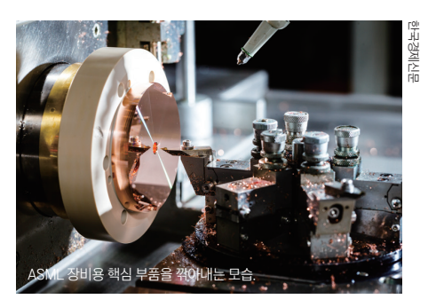
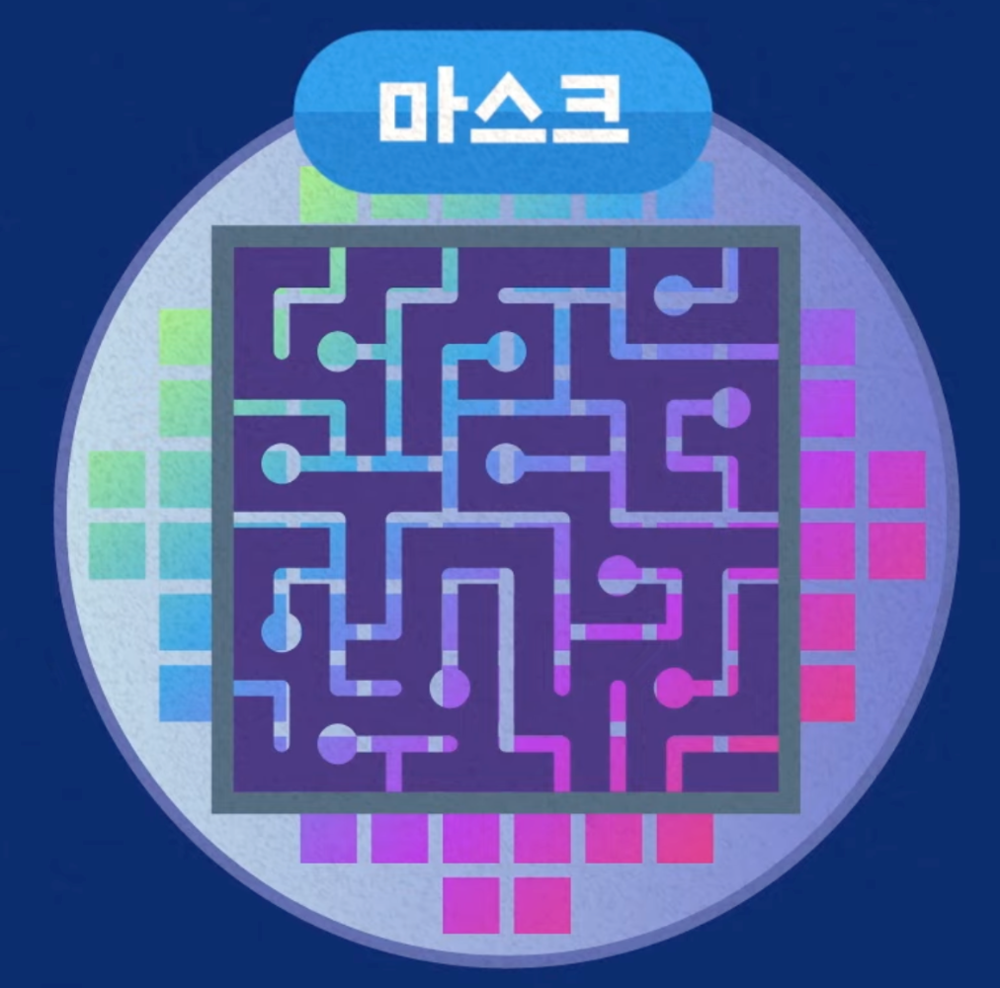

*(한경비즈니스 2026.06 / 김영은 기자)*

## 한 줄 요약

> 좋은 **D램**(쌀)을 만들어야 좋은 **HBM**(밥)이 나온다. 한국(**삼성전자·SK하이닉스**)은 그 비법인 **EUV 장비**와 **핵심 소재**를 가장 먼저·탄탄하게 확보해 AI 시대 메모리 강자가 됐다.

## 핵심 개념 3가지

- **D램**: 컴퓨터가 작업 시 쓰는 메모리 ("쌀 한 톨")
- **HBM**: D램을 수직으로 쌓은 고성능 메모리, AI의 핵심 부품 ("잘 지은 밥")
- **EUV**: 극자외선으로 회로를 정교하게 새기는 최첨단 장비 (한 대 1,500억 원)

## 왜 한국이 앞섰나

- 2021년 **삼성전자가 세계 최초로 D램에 EUV 도입** → 좋은 "쌀" 만드는 비법 선점
- **삼성전자·SK하이닉스** 등 한국 기업들이 **과감한 선제 투자**를 감행
- 미국 마이크론은 2025년에야 도입 (4년 늦음)

## EUV가 일으킨 3대 혁신

1. **생산성 ↑** — 칩이 작아져 웨이퍼 한 장에서 더 많이 생산 (약 25%↑)
2. **성능 ↑** — 회로가 촘촘해져 속도 빨라지고 전력 소모 감소
3. **불량 ↓** — 예전엔 여러 번 겹쳐 그려야(멀티 패터닝) 했지만, EUV는 한 번에(싱글 패터닝) 깔끔하게

## 단점

- 너무 비쌈(1,500억 원↑). 하지만 AI 수요 폭발로 **삼성전자·SK하이닉스**가 과감히 선제 투자해 우위 확보

## 경쟁 구도

- 🇨🇳 **중국**: 미국 제재로 EUV 못 삼. 그래도 CXMT가 DDR5 양산 성공 (격차 3~4년, 무시 못 함)
- 🇯🇵 **일본·소재 독립**: 2019년 일본의 소재 수출 규제 → 위기를 계기로 한국이 국산화 성공
  - 동진쎄미켐: EUV용 포토레지스트
  - 켐트로닉스: 용매 PGMEA

## 결론

> 한국의 HBM 경쟁력 = **① 좋은 장비(EUV 선점)** + **② 안정적 소재(국산화)**
> 삼성전자·SK하이닉스 두 축이 받쳐줘 "좋은 쌀(D램)"을 안정적으로 생산할 수 있게 됐다.
