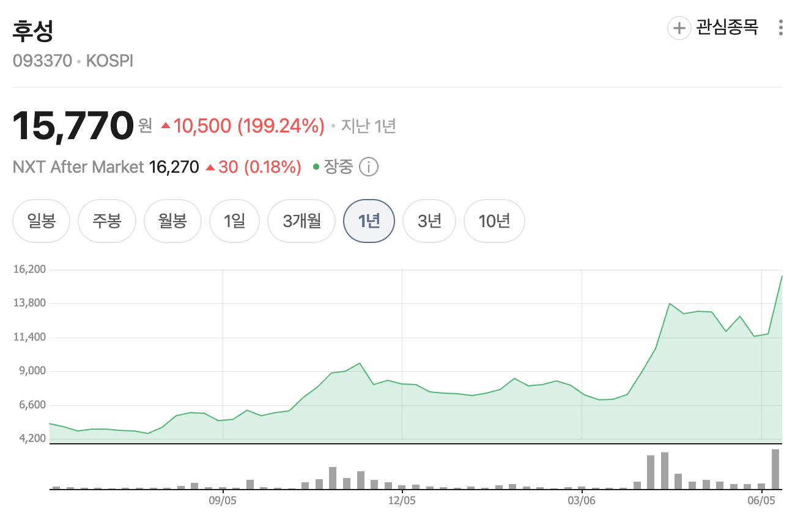
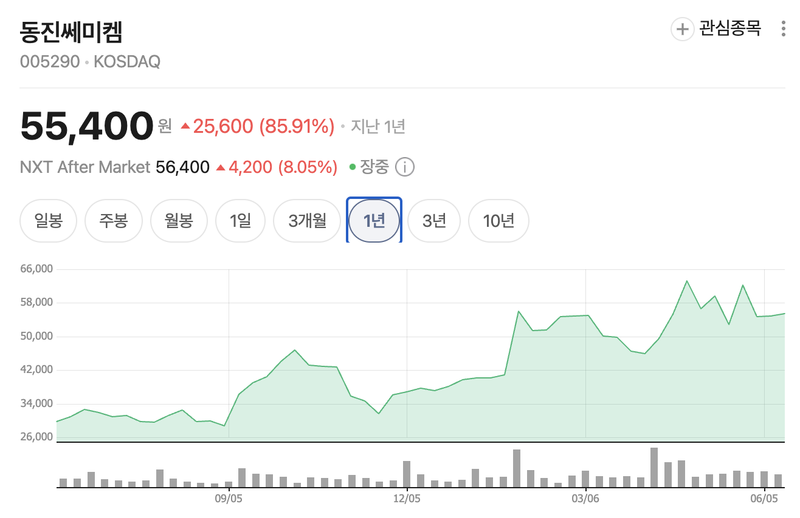
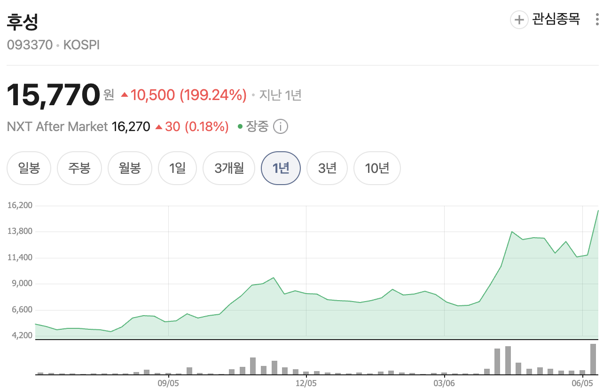

_(한경비즈니스 1591호 · 2026.06 / 김영은 기자)_

## 한 줄 요약

> 장비는 미국이 장악했지만, 소재에서만큼은 한국 기업들이 세계 최초의 자리를 하나씩 빼앗아오고 있다. 코로나바이러스보다 작은 전선 속에서 벌어지는 조용한 주도권 싸움이다.

## 금속배선공정이란?

웨이퍼를 자르고, 회로를 새기고, 깎고, 쌓는 과정을 거쳐도 아직 전기가 흐르지 않는다. 반도체 안에는 수십억 개의 초소형 스위치(트랜지스터)가 들어있는데, 이 스위치들이 서로 연결되지 않으면 아무 의미가 없다. **스위치들 사이에 전선을 깔아주는 것** — 이게 금속배선공정이다.

문제는 이 전선이 어마어마하게 얇다는 것이다. **코로나바이러스(약 100nm)보다 10~20배 더 가는 5~10nm 수준**으로, 머리카락 굵기의 1만 분의 1에 불과한 공간에 금속을 채워 넣어야 한다.

배선은 아파트처럼 층을 나눠서 깐다.

- **지하층(텅스텐, W)** — 소자와 직접 연결되는 가장 중요한 배선. 텅스텐은 고온에서도 버티고 안정성이 뛰어나 소자 바로 옆 '기초 배관' 역할에 적합하다. 다만 딱딱한 고체라 좁은 구멍에 그대로 넣을 수 없어, **불소와 결합한 기체(WF₆, 육불화텅스텐)**로 만들어 좁은 구멍 구석구석까지 스며들게 한 뒤 다시 굳혀서 채운다.
- **상부층(구리, Cu)** — 그 위로는 전기를 빠르고 손실 없이 전달하는 **구리 고속도로**를 깐다. 1990년대 후반부터 알루미늄을 밀어내고 배선의 표준이 됐다. 단, 구리는 실리콘으로 파고들어 소자를 망가뜨리기 때문에 먼저 홈 벽면에 **얇은 방어막**을 바르고, **전기도금** 방식으로 채운다.
- **평탄화(CMP)** — 구리를 채운 뒤 울퉁불퉁해진 표면을 거울처럼 갈아내는 **화학기계연마(CMP)** 공정을 거친다. 이 배선층이 **10~20겹** 쌓이므로 층마다 반복된다. 이때 쓰는 연마액을 **슬러리(Slurry)**라고 한다.

## 왜 중요해졌나

배선이 점점 복잡해지면서 새로운 문제가 생겼다. 반도체 앞면에 데이터 신호선과 전력선이 함께 빽빽하게 엉켜 서로 방해가 되는 것이다.

이를 해결하는 차세대 기술이 **BSPDN(후면전력공급망)**이다. 빌딩 앞문으로 방문객(데이터)과 전기공(전력)이 동시에 들어오면 막히니, **전기공은 뒷문으로** 분리하는 셈이다. 전력선을 칩 뒷면으로 빼내 앞면을 데이터 전용으로만 쓰면 속도가 훨씬 빨라진다. 이 기술이 도입되면 웨이퍼 뒷면도 갈아내야 해서 **CMP 공정이 한 번 더 필요**해지고, 그만큼 CMP 소재 수요가 늘어난다.

소재 국산화 관점에서도 중요하다. 핵심 가스인 **WF₆는 극도로 위험한 맹독성 물질**이라 과거 전량 일본에서 수입했지만, **SK스페셜티와 후성**이 오랜 연구 끝에 국산화에 성공했다. 반도체 소재 중 국산화가 가장 어려운 축에 속하는 사례다.

## 시장과 기업

- **장비 — 미국 AMAT 독점**: 구리를 도금하는 ECD 장비, 갈아내는 CMP 장비, 방어막 장비까지 구리 배선 관련 고난도 장비 시장은 **미국 어플라이드머티리얼즈(AMAT)**가 통째로 쥐고 있다. 국내 기업이 가장 파고들기 어려운 영역이다.
- **소재 — 한국 추격**: 장비는 미국이 장악했지만 소재에서는 한국 기업이 치고 나오고 있다. 특히 HBM이 뜨면서 특수 슬러리 분야에서 두각을 나타낸다.
  - **솔브레인**: HBM에서 칩을 관통하는 구멍(TSV)에 구리를 채운 뒤 표면 밖으로 넘친 구리를 정밀하게 깎아내는 **특수 슬러리를 세계 최초로 개발**. 외국 기업이 독점하던 시장에서 삼성·SK하이닉스 양사에 공급하며 판도를 뒤집었다.
  - **동진쎄미켐**: HBM용 특수 구리 슬러리 개발을 완료하고 **2024년 대기업 양산 라인에 진입**, 솔브레인 독주 시장에 경쟁자로 진입했다.
  - **SK스페셜티·후성**: 맹독성 가스 WF₆ 국산화에 성공한 핵심 소재 기업.

## 결론

> 증착공정보다는 살짝 힘이 덜해보이지만 반도체는 짱이다.

## 참고 자료

| 자료                                                                                             | 활용한 내용                                                            |
| ------------------------------------------------------------------------------------------------ | ---------------------------------------------------------------------- |
| 한경비즈니스 1591호 (2026.06, 김영은 기자) — "코로나바이러스보다 작게 — 반도체 전기 혈관을 뚫다" | 금속배선공정 전체 개념, 텅스텐·구리 배선, CMP·슬러리, BSPDN, 기업 동향 |
