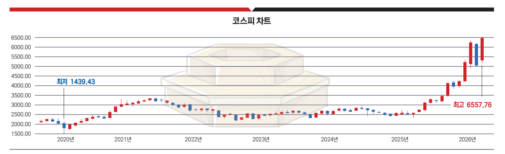

*(한경비즈니스 2026.06.10-16 / 최수진 기자 · 박병창 교보증권 이사 분석·인터뷰)*

## 한 줄 요약

> 단기는 금리·환율·유가 변동성이 흔들지만, 장기는 **AI 기술혁신 + 국가 주도 산업정책**이 증시 상승의 핵심 동력. 외국인 복귀의 진짜 타이밍은 **지수 조정 + 원화 강세**가 겹치는 시점.

## 코스피 지수 등락의 의미는?

**핵심 답: 코스피의 등락은 "AI·구조개혁이라는 장기 상승 엔진"과 "금리·물가라는 단기 브레이크"의 줄다리기를 보여준다. 변동성 속에서도 낙폭을 회복한 것은 엔진(AI)이 살아 있다는 의미이고, 그럼에도 물가·금리가 최대 우려인 이유는 이 시장이 유동성으로 올라온 만큼 돈줄이 막히면 추세가 꺾일 수 있기 때문이다.**

| 구분 | 누가 | 역할 |
| --- | --- | --- |
| 큰 방향(추세·상승) | AI + 구조개혁 | 장기 상승 엔진 → 낙폭을 회복시키는 힘 |
| 단기 출렁임(변동성) | 금리·환율·유가 | 단기로 시장을 흔드는 파도 |
| 최대 위험(추세를 꺾을 변수) | 물가·금리 | 상승 엔진을 멈출 수 있는 브레이크 |

- 2025년 6월 **2,692 출발** → 거버넌스 개혁 기대·반도체 슈퍼사이클·ETF 자금 유입으로 가파른 상승
- 2월 말 **5,000 돌파** 과정에서 포모성 매수 유입 → 수급 과열, 거래량 급증
- 급락·반등 반복하며 높은 변동성, 그러나 **낙폭 모두 회복**
- 박 이사: "AI 수요가 뒷받침했지만 **국채금리 상승·사모 신용 부실·AI 자본지출 과열**은 위험 요인"
- 3월 **미국–이란 전쟁**이 단기 투매 유발
  - 단기 종료 시 유가·국채수익률 안정 가능
  - 장기화 시 인플레이션 + 경기 둔화 동시 = **스태그플레이션 위험** 확대
- "첫 충격엔 진위 파악보다 투매가 먼저" → 코스피 **이틀 급락 후 강한 반등·재하락, 약 7주간 큰 변동성**
- 핵심 우려 = **물가와 금리**
  - 인플레이션 → 금리 상승 → 기업 자금조달 비용 증가, 소비 위축, 자산가격 하락
  - 미국 국가부채 증가·높은 국채수익률, 유럽·일본 금리 상승 → **채권발 위험**
  - 미국 사모 신용 시장 부실 우려도 제기
- AI 열풍이 반도체·에너지 수요 자극 → 새 인플레 압력 (데이터센터 건설, 막대한 유동성 정책이 하반기 물가 요인)
- 물가는 오르는데 중앙은행이 금리 못 내리는 상황 = 주식시장에 치명적
- 다행: 시장이 **전쟁 악재 극복** (미국 시장도 전쟁보다 금리·국채수익률에 더 민감), 필라델피아반도체 지수·반도체 기업 신고가, 코스피도 3월 하락 회복해 강세장
- 경계 변수: ▲중동 불확실성 ▲금리·환율·유가 방향성 ▲경기침체 가능성

## 주식시장 강세의 배경은?

**핵심 답: ① AI 기술혁신 사이클 ② 미국 제네시스 미션 ③ 국내 거버넌스 개혁, 이 세 축이 구조적 강세를 떠받침.**

- **① AI 기술혁신 사이클**
  - 2022년 챗GPT 등장 이후 시장 중심축으로 부상
  - 엔비디아 등 급등·버블 논란, 빅테크 대규모 투자·데이터센터·회사채 발행이 우려 키웠으나 AI는 성장 핵심축
  - 시장은 AI 인프라 구축 후 **투자금의 현금흐름 회수**에 주목
  - 사이클은 실험·배포 → **응용 단계로 이동 중**
  - "버블 가능성 있지만 AI 칩·컴퓨팅 수요 급증, 데이터센터 투자 계속 확대 중"
- **② 미국 제네시스 미션**
  - AI로 과학·산업·국가안보 혁신을 추진하는 **국가 프로젝트**
  - AI·로봇 활용 제조업 리쇼어링 → 중국 패권 경쟁·양극화 해소·부채 부담 완화 동시 추진
  - AI가 국가안보 자산으로 부상, **민간 주도 → 국가 주도 혁신**으로 경쟁 격화
  - 핵심은 **'중국 배제 전략'** — 반도체·자동차·로봇·바이오·배터리 소재·통신장비 등 중국 의존 축소, 동맹국 중심 공급망 구축
  - 제조업 강국 **한국에 큰 기회** → 반도체뿐 아니라 조선·방산·자동차·기계·원자력·전력 에너지 수혜 기대
- **③ 국내 거버넌스 개혁**
  - 상법·세법 개정, ISA 확대, MSCI 선진국지수 편입 추진, 퇴직연금·ETF 투자 확대 → 자금 유입 촉진
  - 부동산·예금 중심 자금이 생산적 금융·주식시장으로 이동하는 **구조적 변화**
- **종합 전망**
  - AI 기술혁신은 이제 시작 단계, 미국 제조업 부활 + 거버넌스 개혁 = 한국 증시에 **역사적 기회**
  - 위험 요인(정부 부채, 국채수익률 상승, AI 자본지출 과열, 물가·유가 상승) 존재
  - 그러나 시장은 금리인하 기대·재정 확대·구조적 개혁에 힘입어 강세 유지
  - "단기 노이즈보다 **AI 기술혁신·거버넌스 개혁이라는 큰 흐름**을 읽는 것이 중요", "큰 물줄기에서 벗어나 **잔파도에 흔들리지 않는 것**이 중요"

## 제목 — "금리·환율에 갇힌 유동성"이 뜻하는 것은?

**핵심 답: 주식시장은 결국 금리와 환율에 따른 유동성의 흐름이며, 지금은 높은 금리·약한 원화가 그 흐름을 가둬둔 상태.**

- "주식시장은 간단명료하다. 금리와 환율에 의한 유동성의 흐름이다"
- 현재 시장 이해의 핵심 키워드 = **AI** + **국가 주도 산업정책**
- 단기: 금리·환율·유가 변동성이 시장을 흔듦
- 장기: AI 기술혁신·산업구조 변화가 증시 상승의 핵심 동력

## 제목 — "130조 순매도한 외인이 노리는 진짜 타이밍"은 언제?

**핵심 답: 지수 조정 + 원화 강세가 함께 오는 시점 → 그때 외국인이 매수 주체로 전환.**

- 외국인은 올해만 코스피 **130조 순매도**
- 코스피는 2025년 6월 이후 대세 상승이나 외국인 본격 신규 투자는 거의 없음
- 이유: 시장이 너무 빨리 급등, 환율 **1,500원 전후**로 외국인에게 불리
- **지수 조정 + 환율 우호(원화 강세)** 흐름이면 외국인이 국내 증시 매수 주체가 될 수 있음
- 💡 약한 원화에 들어가도 더 약해지면 환손실 → 외국인은 "약한 원화"가 아니라 **"앞으로 강해질 원화"**를 노림

## (인터뷰) 코스피 9,000 임박, 연내 조정 올까?

**핵심 답: 올해 전강후약 — 하반기 조정 예상. 단기 급등이 가장 큰 부담.**

- 상반기: 연준 금리인하 기대 + AI 인프라 구축 실적 증가 반영
- 지수 9,000선 임박, 반도체 등 이익 증가 추정치 근거로 **1만p 가시화**
- 조정 최대 이유 = **단기 급등** (5개월 만에 100%↑)
- 신용융자 **37조**, 삼성전자·SK하이닉스 극단적 수급 쏠림 → 변동성 확대
- 유가 높은 수준 유지 + 아시아 통화 약세 동반, 원화도 약세권 변동성 확대
- 유럽·일본 금리인상 계획, 한국은행도 올해 한두 차례 인상 가능성(매파적), 3년물 국고채 **3.79% 급등**
- 하반기 최대 우려 = **물가발 글로벌 기준금리 인상 기조**

## (인터뷰) 반도체·조선·방산 다음 수혜 업종은?

**핵심 답: 주도주 추종이 유리. 조정 구간엔 전력 에너지 순환, 다음 단계는 AI 모델 기업.**

- 이번 상승은 AI 인프라 구축 대세 상승 → 주도주 변화보다 **주도주 추종**이 유리
- 반도체 단기 급등 조정 구간 시 **조선, 전력 에너지(원자력·전력기기·송배전·ESS)** 순환 예상
- 젠슨 황 조언대로 AI 성장 경로 = **인프라(전력) → 데이터센터 → 칩 → AI 모델 → 애플리케이션**
- 현재 수급은 **데이터센터 → 칩**으로 전환
- 다음은 AI 활용 제품·서비스를 제공하는 **AI 모델 기업**이 될 수 있음
