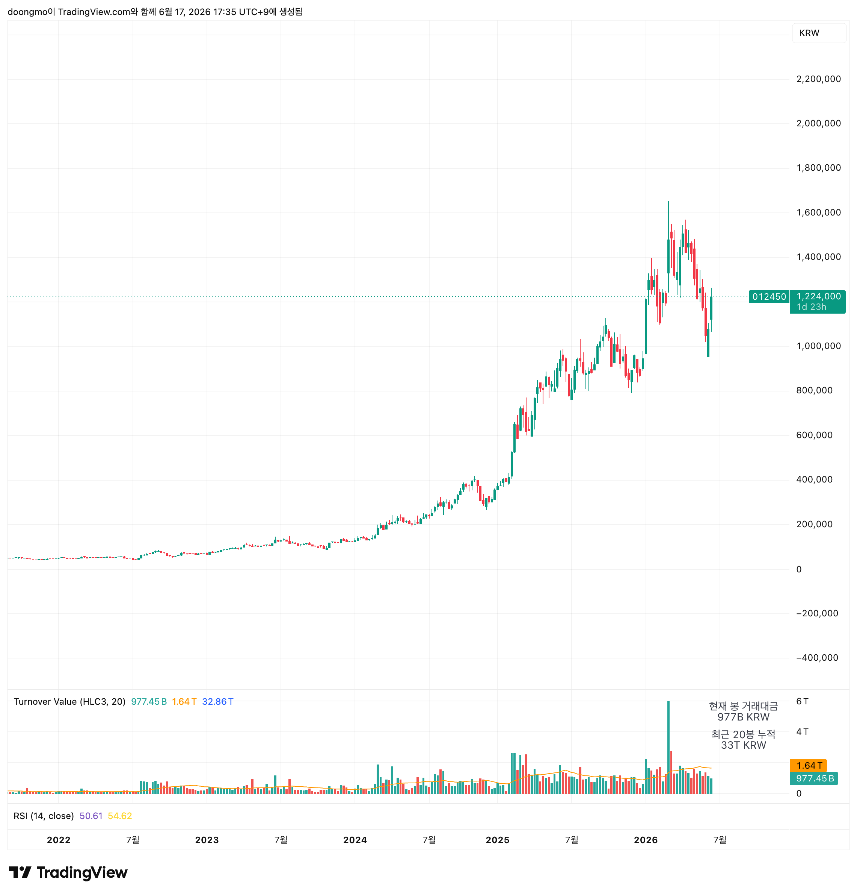
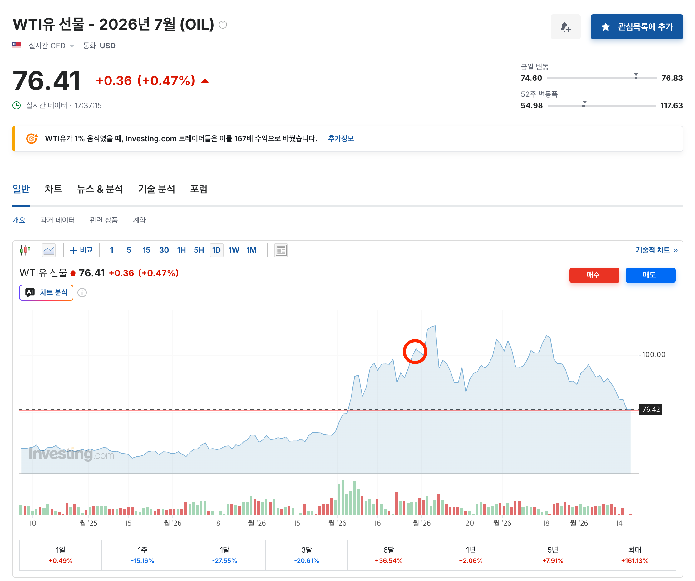
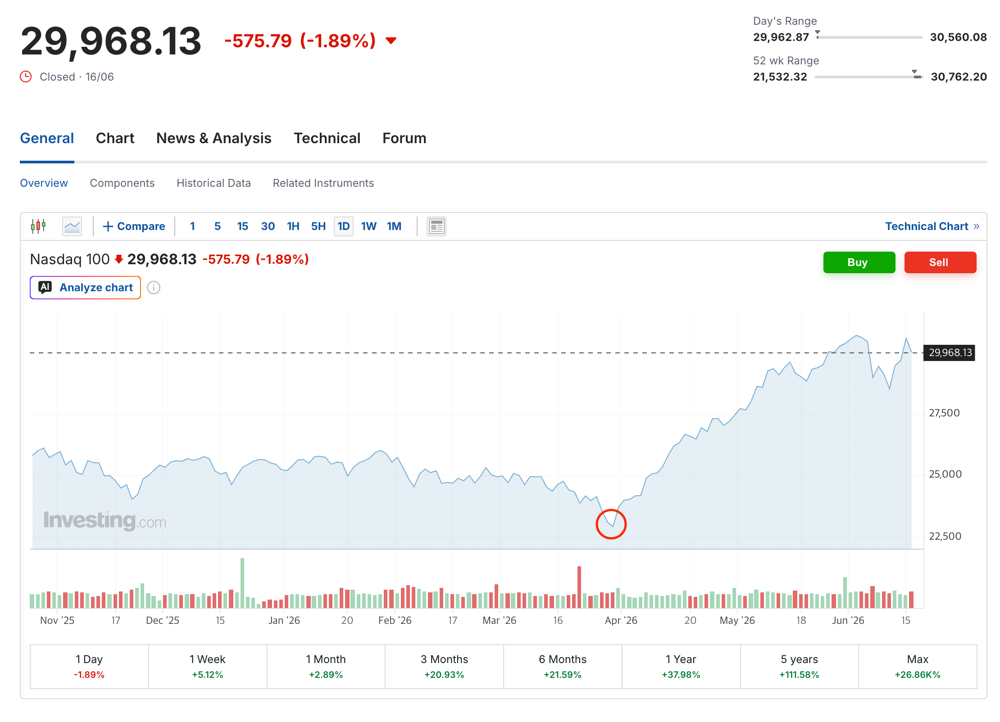

## 한 줄 요약

> 호르무즈해협이 빨리 개방되어야 주식시장을 기대할 수 있다.
> 근데 개방됐다!! 과연

조윤남 코어 16대표는 미국 이란 전쟁이 단순 중동 분쟁이 아닌 “지정학”, “에너지 공급 충격”, “거시경제” 세개의 사이클이 동시에 교차한다고 말한다.

**사이클을 적절한 유형으로 분리해 과거의 비슷한 사이클을 찾아서 다음 국면을 전망해야 한다고 한다.**

### 새 국면을 맞은 지정학적 사이클

냉전이 끝난 후 1990년대부터 10년간 꾸준하게 국방비 비중은 줄어들었다. 국방이 아닌 세계화를 통한 시장과 자본 흐름이 최고의 안정장치라고 믿고있었지만, **911 테러, 2014년 크림반도, 2022년 러우전쟁을 거치며 이 흐름은 달라졌다.**

- 2024년 세계 군사비 총액은 2023년 대비 9.4%가 증가했다. (냉전 종전 이후 최고치다.)

> ⇒ 재무장 사이클로의 구조적 전환이 발생하는 중이다.

**미 이란 전쟁이 지정학 사이클의 임계점이라고 보이고 앞으로는 군사비를 늘려갈 전망으로 보인다.**

[한화에어로스페이스 주봉]

### 에너지 공급 충격 사이클

미 이란 전쟁의 가장 큰 특징은 에너지 공급망에 변화를 가져온 것이다.

이란이 호르무즈해협 무기로 삼았다 === **무기 교전 → 에너지 물류 통제**

- 세계 원유 25%, LNG 20%가 호르무즈해협을 통해서 오가고 있었다.
- 아시아 입장에서는 원유 84%, LNG 83%가 의존하고 있다.

단순히 원유 가격 상승이 아니다. 연쇄작용이 발생한다.

> 유가 상승 → 물가 상승(인플레이션) → 금리 환율에 영향 → 주식 시장에 영향

[원유 가격]

[나스닥 가격]

### 호르무즈해협의 정상화가 포인트

조대표는 미 이란 전쟁이 1979년 2차 오일쇼크와 비슷하다고 한다.

1. 1979년 이란혁명, 1980년 이란 이라크 전쟁으로 원유 생산이 급감
2. 1년만에 배럴당 14달러 → 25~39달러로 폭등
3. 인플레이션이 올 것 같다는 경제 주체들의 판단
4. 1981년 Fed는 금리 11% → 19%까지 향상
5. **[???]** 1973년 ~ 1974년 베어마켓에서 S&P500은 48% 하락
   1. 1973년 ~ 1974년은 1차 오일 쇼크 (원유 4배)
   2. 2차 오일쇼츠 1979~1781은 1980~1982 27% 하락 후 1982 대 강세장

**조대표는 다를 수 있다는 의견도 함께 제시**

1. 봉쇄를 협상의 레버리지로 활용하기 때문에 협상 진전 시 열 수 있다.
2. 과거에는 원유가 중동에 의존적이었지만, 현재는 미국 셰일, 전략비축유 등 대체제가 있다.
   1. 과거의 비슷한 사이클이 있었음
   2. 1990년 8월 이라크 쿠웨이트 침공으로 유가 급등
   3. S&P500 20% 하락
   4. 1991년 1월 미국 작전 후 시장은 반등

> **핵심은 호르무즈의 빠른 해방 → 인플레이션 완화 → Fed의 금리 인하 고려 가능성 향상 → 위험시장의 정상화**

## 참고 자료

| 자료 | 활용한 내용 |
| ---- | ----------- |
|      |             |
