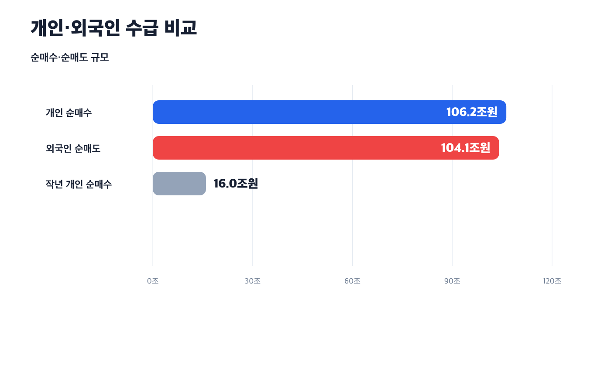
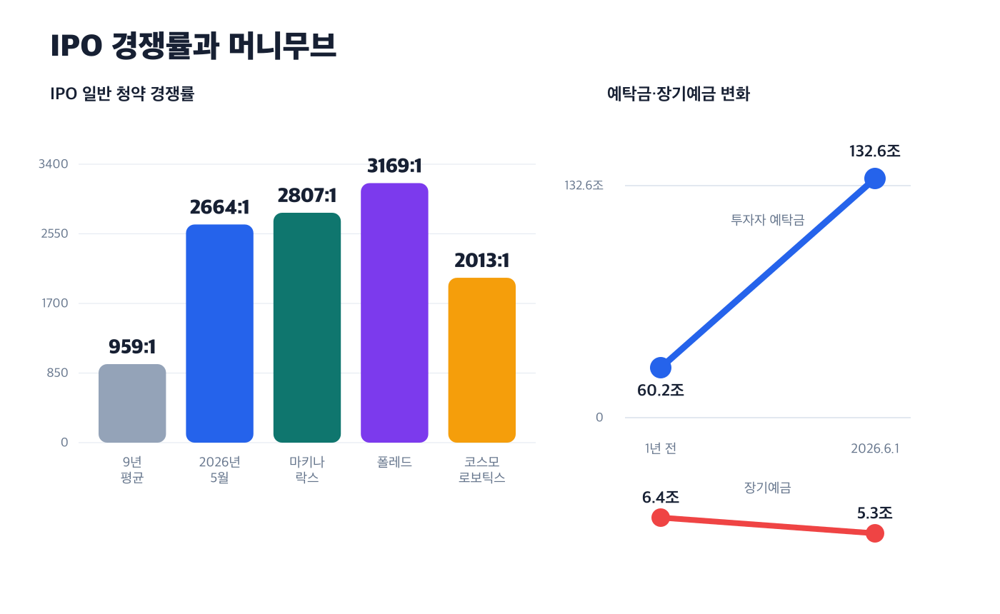
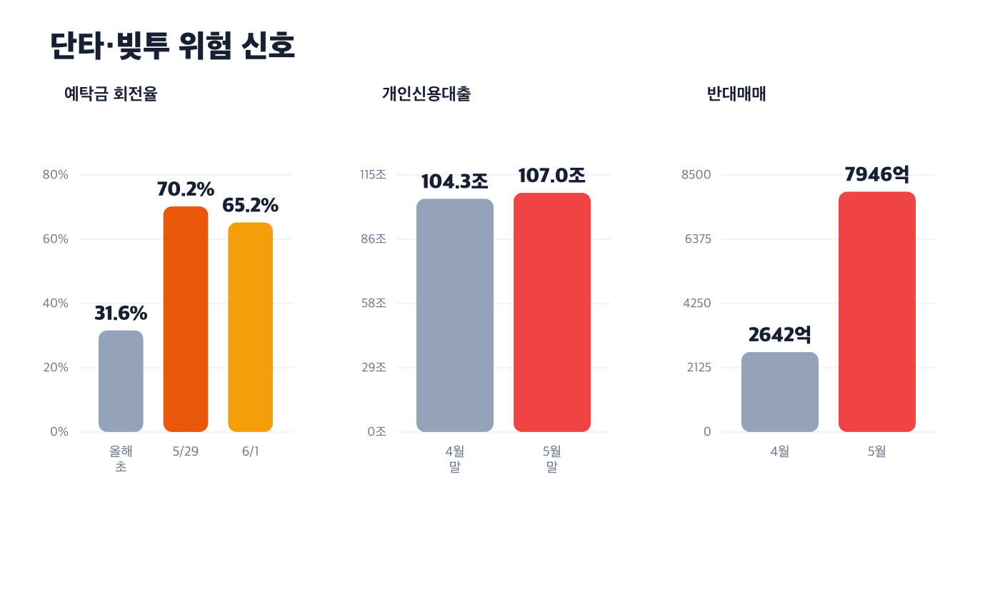
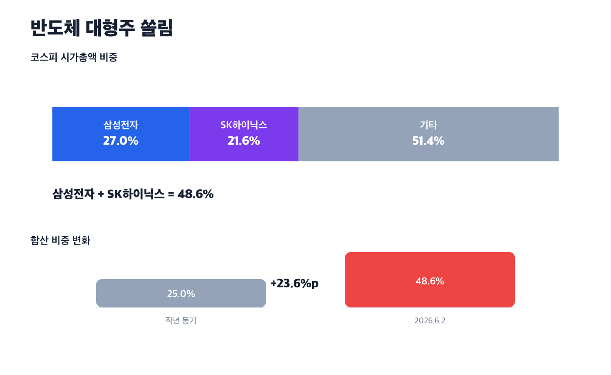

> 원문 매체, 발행일, URL은 확인 필요. 아래 내용과 차트는 사용자가 제공한 메모의 수치를 바탕으로 재구성했다.

## 한 줄 주장

개인투자자 자금, 즉 **리테일 머니**가 한국 증시의 핵심 수급으로 올라섰다. 좋은 변화일 수 있지만, 이 돈이 장기·분산·현금 기반 자본인지 단기·레버리지·쏠림 자금인지에 따라 시장 안정판이 될 수도 있고 조정장의 매도 압력이 될 수도 있다.

## 발표 흐름

1. 개인은 외국인 매도 물량을 거의 그대로 받아내며 증시 하단을 지지했다.
2. IPO 흥행, 기업 IR 강화, 예금·부동산에서 금융투자로의 이동은 긍정적인 변화다.
3. 하지만 예탁금 회전율, 신용대출, 반대매매 증가는 단타와 빚투의 신호일 수 있다.
4. 반도체 대형주 쏠림과 5060 신용융자는 조정장에서 **리테일 런**의 뇌관이 될 수 있다.

## 1. 개인이 핵심 수급이 됐다

올해 초부터 2026년 6월 2일까지 개인은 코스피·코스닥과 ETF를 합쳐 **106조2471억원**을 순매수했다. 같은 기간 외국인은 **104조891억원**을 순매도했다. 메모 기준으로 보면 외국인이 판 물량을 개인이 거의 그대로 흡수한 셈이다.

지난해 개인 순매수는 약 16조원이었다. 올해는 약 5개월 만에 지난해 연간 규모의 약 6.6배가 들어왔다. 이 변화는 개인투자자가 더 이상 주변 수급이 아니라 시장 하단을 받치는 핵심 주체가 됐다는 뜻으로 읽힌다.

## 2. 좋은 면: 모험자본과 금융투자 전환

리테일 머니가 모두 위험한 것은 아니다. 개인 청약 열기는 IPO 흥행의 핵심 변수로 올라섰고, 기술특례상장 기업이나 혁신기업 입장에서는 자금 조달의 마중물이 될 수 있다.

메모에서 특히 눈에 띈 변화는 세 가지다.

- 2026년 5월 IPO 일반 청약 경쟁률은 **2664 대 1**로, 최근 9년 평균 **959 대 1**의 약 2.8배였다.
- 투자자 예탁금은 2026년 6월 1일 **132조5992억원**으로, 1년 전 **60조1885억원**의 약 2.2배였다.
- 5대 은행의 3년 초과 장기 예금은 지난해 1분기 **6조4097억원**에서 올해 1분기 **5조2921억원**으로 줄었다.

기업의 소통 방식도 바뀌고 있다. 호텔신라는 소액주주 대상 별도 IR을 준비하고, 포스코인터내셔널은 실적 발표 IR에 웹캐스팅을 도입했으며, 키움증권은 개인투자자 대상 코스닥 기업 설명 행사를 진행했다. 개인투자자 영향력이 커지면서 기업이 소액주주와 직접 소통해야 할 유인이 커진 것이다.

## 3. 위험한 면: 돈의 속도가 너무 빠르다

문제는 시장에 들어온 돈이 장기 보유 자금인지, 빠르게 돌고 있는 단기 매매 자금인지다. 예탁금 회전율은 올해 초 **31.6%**에서 5월 29일 **70.2%**, 6월 1일 **65.2%**까지 올라왔다.

개인신용대출은 2026년 4월 말 **104조3413억원**에서 5월 말 **106조9909억원**으로 한 달 만에 약 **2조6496억원** 늘었다. 반대매매도 4월 **2642억원**에서 5월 **7946억원**으로 약 3배 증가했다.

이 흐름이 위험한 이유는 연결 구조 때문이다. 주가가 하락하면 담보비율이 낮아지고, 반대매매가 나오고, 강제매도가 다시 주가를 누를 수 있다. 리테일 머니가 평소에는 하방 지지 수급이지만, 조정장에서는 한꺼번에 빠져나가는 **리테일 런**으로 바뀔 수 있다.

## 4. 반도체 쏠림은 지수 상승을 취약하게 만든다

메모 기준 2026년 6월 2일 코스피 전체 시가총액은 **7793조원**, 삼성전자는 **2107조원**, SK하이닉스는 **1681조원**이다. 두 기업 합산은 **3788조원**으로 코스피 전체의 **48.6%**다.

지난해 같은 기간 두 기업 비중은 25%였고, 1년 만에 48.6%로 높아졌다. 유진투자증권 추정 기준으로 올해 반도체 영업이익이 코스피 전체 영업이익의 60% 후반대라는 점도 같은 방향의 신호다.

또 2026년 5월 29일 한국 ADR은 **52%**였다. 오른 종목 수가 내린 종목 수의 절반 수준이라는 의미라면, 지수 상승이 시장 전체의 고른 강세라기보다 일부 대형주에 기대고 있을 가능성을 보여준다.

단, 이 문단의 코스피 전체 및 개별 기업 시가총액 수치는 메모 기준으로 옮겼다. 단위와 기준일은 원문 확인 필요.

## 5. 퇴직연금과 5060 빚투가 불안한 이유

퇴직연금은 전체 자산의 30% 이상을 안전자산으로 편입해야 한다. 그런데 채권혼합형 ETF는 자산의 50% 이상이 채권이면 안전자산으로 분류될 수 있다. 예를 들어 `1Q K반도체TOP2채권혼합50`은 삼성전자 25%, SK하이닉스 25%, 나머지 50%를 단기국고채·통안채에 투자하는 구조다.

제도상 안전자산처럼 보일 수 있지만, 실제 수익과 위험은 특정 대형주 2개에 크게 좌우된다. 노후자금 성격의 돈이 이런 상품에 들어가면 투자자가 느끼는 안전성과 실제 위험 사이에 간극이 생길 수 있다.

신용융자에서도 비슷한 문제가 보인다. 2026년 1분기 상위 10개 증권사의 신용융자 잔액은 약 **27조2000억원**이고, 50대 이상 비중은 **62.3%**였다. 50대는 **8조9762억원**, 60대 이상은 **8조189억원**이었다. 조정장에서 손실과 반대매매가 겹치면 은퇴자산 훼손으로 이어질 수 있다.

## 내가 이해한 쟁점

이번 기사의 핵심은 개인투자자 증가 자체를 문제 삼는 것이 아니다. 오히려 리테일 머니는 한국 증시의 수급 기반을 넓히고, IPO 시장과 기업 IR 문화를 바꾸고, 부동산·예금 중심 자산 형성 경로를 금융투자로 확장한다.

다만 좋은 변화로 정착하려면 자금의 성격이 바뀌어야 한다. 핵심은 **규모가 아니라 질**이다. 장기·분산·현금 기반 투자로 남으면 자본시장의 체력이 되지만, 레버리지·단타·테마 쏠림으로 몰리면 조정장에서 시장 변동성을 키울 수 있다.

## 같이 이야기해보고 싶은 질문

- 지금 개인 자금 유입은 장기 투자 문화의 시작일까, 단기 유동성 장세일까?
- ISA와 연금계좌 확대는 실제로 장기투자를 늘릴까, 아니면 고위험 상품을 담는 그릇만 키울까?
- 퇴직연금 안전자산 규정은 채권혼합형 ETF의 실질 위험을 충분히 반영하고 있을까?
- 반도체 대형주 쏠림은 한국 증시 재평가의 근거일까, 시장 폭 축소의 경고일까?
- 리테일 런을 막으려면 개인투자자 교육보다 상품 규제나 신용융자 관리가 더 중요할까?

## 확인 필요

- 원문 기사 매체, 발행일, URL
- 코스피 전체 시가총액과 삼성전자·SK하이닉스 시가총액의 단위 및 기준일
- ADR 52%의 정확한 산식과 해석 기준
