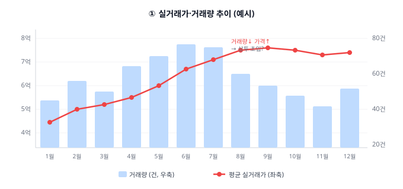
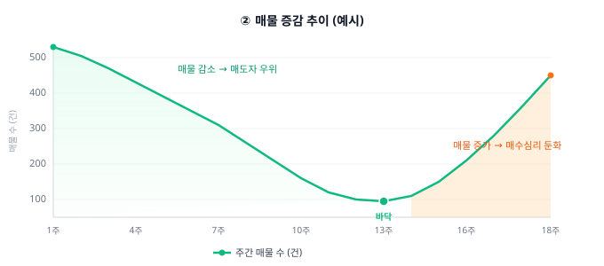
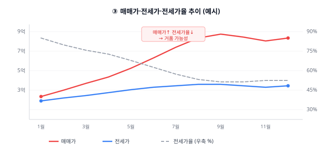
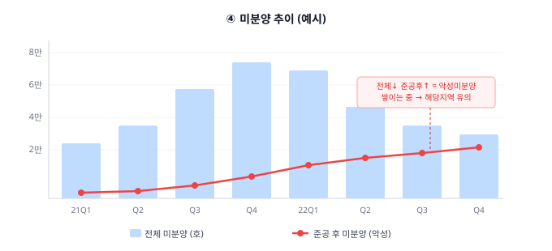
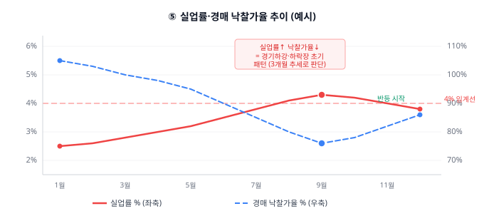

# 부동산 시장 진짜 지표 — 직접 조회하는 법
### 초보라 노트 실전 활용 가이드

## 들어가며

아래 정리는 「초보라 노트」에 나온 6가지 부동산 지표(실거래가·거래량, 환금성, 매물량, 전세가율, 미분양, 거시 지표)를 실제로 어디서, 어떻게 조회할 수 있는지 정리한 실전 가이드다. 각 항목마다 공식 데이터 출처와 민간 앱을 함께 소개해 서로 교차 검증할 수 있도록 했다.

---

## 1. 호가 vs 실거래가 — 실거래가·거래량 조회

실거래가는 국토교통부가 「부동산 거래신고 등에 관한 법률」에 따라 신고받아 공개하는 데이터가 원본이다. 계약 후 30일 이내 신고 의무가 있어, 최근 계약 건은 아직 조회되지 않을 수 있다.

| 구분 | 사이트 / 앱 | 특징 및 활용 팁 |
|---|---|---|
| 국토부 실거래가 공개시스템 | [rt.molit.go.kr](https://rt.molit.go.kr) | 정부 공식 원본 데이터. 아파트/연립다세대/단독다가구/오피스텔/토지 등 유형별 매매·전월세 실거래를 지역·기간별로 조회. 로그인 불필요, 무료. |
| 국토부 실거래가 GIS 지도 | [rt.molit.go.kr/pt/gis/gis.do](https://rt.molit.go.kr/pt/gis/gis.do) | 지도 위에서 단지별 거래 내역을 마커로 확인. 해제(취소) 거래는 붉은색으로 표시. |
| 공공데이터포털 Open API | [data.go.kr — 아파트 매매 실거래가](https://www.data.go.kr/data/15126469/openapi.do) | 법정동 코드+계약년월로 대량 데이터를 API로 받아 엑셀·분석에 활용 가능(개발/자동화용). |
| 아실 (아파트 실거래가) | [asil.kr](https://asil.kr) | 단지 간 가격 추이 비교, 매물 증감 추이, 외지인 매수 비중 등 투자 관점 분석에 특화. |
| 호갱노노 | [hogangnono.com](https://hogangnono.com) | 지도 기반 UI, 실거주자 리뷰·학군·인프라 등 실거주 관점 정보가 풍부. |
| 한국부동산원 R-ONE | [reb.or.kr/r-one](https://www.reb.or.kr/r-one/portal/stat/easyStatPage.do) | 지역별 월간 매매·전월세 거래량 통계(공식 집계). |

> **Tip:** 아실·호갱노노는 모두 국토부 원본 데이터를 가공한 것이라 금액 자체는 동일하다. 다만 갱신 시점 차이가 있을 수 있으니 최종 확인은 국토부 시스템에서 하는 것이 안전하다. '건강한 거래량(총 세대수의 0.5~0.8%/월)' 판단 시, 단지 세대수는 국토부 GIS나 호갱노노 단지 정보에서 함께 확인하면 편하다.

---

## 2. 환금성 · 매물량 조회

환금성과 매물량은 국토부 공식 시스템보다 민간 플랫폼이 더 직관적으로 보여준다. '현재 매물이 쌓이고 있는지, 빠지고 있는지'의 추이를 시각화해주기 때문이다.

| 구분 | 사이트 / 앱 | 특징 및 활용 팁 |
|---|---|---|
| 아실 매물 증감 추이 | [asil.kr](https://asil.kr) | 지역/단지별 매물 수 변화를 그래프로 제공. 매물이 빠르게 줄면 매도자 우위, 계속 쌓이면 매수자 우위로 해석. |
| 호갱노노 매물란 | [hogangnono.com](https://hogangnono.com) | 단지 상세 페이지에서 현재 매물 수, 최근 등록/거래 흐름을 확인. |
| 네이버부동산 | [land.naver.com](https://land.naver.com) | 실시간 매물 호가와 개수를 확인해 실거래가와 비교하는 용도로 활용. |
| 부동산플래닛 | [bdsplanet.com](https://www.bdsplanet.com) | 가격 변동률을 지도 위 색상(상승/하락)으로 시각화, 지역 단위 흐름 파악에 유용. |

---

## 3. 전세가율 조회

전세가율(매매가 대비 전세가 비율)은 실거주 가치를 가늠하는 핵심 지표다. 대표적으로 3곳에서 확인할 수 있다.

| 구분 | 사이트 / 앱 | 특징 및 활용 팁 |
|---|---|---|
| 부동산지인 빅데이터지도 | [aptgin.com](https://aptgin.com) | 시도·구·동·단지 단위로 전세가율을 지도에 색상으로 표시. 연도별 추이도 함께 제공. |
| KB부동산 데이터허브 | [data.kbland.kr](https://data.kbland.kr/weathermap) | 'KB통계기상도'에서 지역별 전세가율을 날씨 아이콘처럼 직관적으로 제공, 엑셀 다운로드도 가능. |
| 국가통계포털 KOSIS | [kosis.kr](https://kosis.kr) | 통계청이 직접 운영하는 공식 통계. 한국부동산원이 작성한 전국 매매가·전세가 지수를 기간·지역별로 조회. |

> **Tip:** 같은 단지라도 사이트마다 표본(실거래 vs 호가 기반)이 달라 수치가 조금씩 다를 수 있다. 절대값보다는 '상승/하락 추세'를 보는 용도로 쓰는 게 안전하다.

---

## 4. 미분양의 진실 — 미분양 현황 조회

국토교통부가 매월 말 기준으로 전국·지역별·규모별 미분양 통계를 발표한다.

| 구분 | 사이트 / 앱 | 특징 및 활용 팁 |
|---|---|---|
| 국토교통 통계누리 | [stat.molit.go.kr](https://stat.molit.go.kr) | 국토부 공식 통계 사이트. '주택 > 미분양주택현황보고'에서 기간·지역·규모별 원본 데이터를 조회. |
| KOSIS 미분양 통계 | [kosis.kr](https://kosis.kr/statHtml/statHtml.do?orgId=116&tblId=DT_MLTM_2082) | 통계청 포털에서 같은 데이터를 표/그래프로 제공, 시계열 다운로드가 편리. |
| KB부동산 데이터허브 미분양 | [data.kbland.kr — 미분양](https://data.kbland.kr/publicdata/unsold-apartments) | 지역별 미분양 변동률을 요약 카드 형태로 보여줘 월별 증감을 빠르게 파악 가능. |
| e-나라지표 | [index.go.kr](https://www.index.go.kr) | 정부 대표 지표 사이트. 연도별 미분양 추이와 정책 대응 히스토리를 함께 확인. |

> **Tip:** '준공 후 미분양(악성 미분양)' 수치는 시장 침체의 더 강한 신호로 취급된다. 통계누리·KOSIS 모두 '준공 후 미분양'을 별도 항목으로 제공하니 전체 미분양과 구분해서 봐야 한다.

---

## 5. 거시적인 지표 — 실업률 · 경매 낙찰가율

| 구분 | 사이트 / 앱 | 특징 및 활용 팁 |
|---|---|---|
| KOSIS 고용동향(실업률) | [kosis.kr](https://kosis.kr) | 통계청이 매월 발표하는 실업률·고용률 통계. '고용·노동' 카테고리에서 지역별·연령별 세분화 조회 가능. |
| 지지옥션 | [ggi.co.kr](https://www.ggi.co.kr) | 국내 대표 경매정보 업체. 지역·물건별 낙찰가율(감정가 대비 낙찰가) 통계와 실시간 경매 결과 제공. |
| 굿옥션 | [goodauction.com](https://www.goodauction.com) | 지지옥션과 함께 양대 경매정보 서비스. 낙찰가율, 응찰자 수 등 통계 대시보드 제공. |
| 한국부동산원 R-ONE | [reb.or.kr/r-one](https://www.reb.or.kr/r-one/portal/stat/easyStatPage.do) | 전국주택가격동향조사 등 공식 부동산 가격지수를 함께 참고하면 거시 흐름 교차 검증에 도움. |

> **Tip:** 실업률 4% 돌파 여부처럼 '임계값'을 기준으로 삼는 지표는 KOSIS에서 월별 시계열을 그래프로 보면 추세 파악이 쉽다. 경매 낙찰가율은 지지옥션·굿옥션 모두 무료 요약 통계를 제공하니 두 곳을 교차 확인하면 좋다.

---

## 6. 대표 케이스 그래프로 보는 해석법

아래 그래프는 실제 사이트(국토부·아실·KB부동산·통계누리·지지옥션 등)에 접속하지 않아도, 화면에서 자주 보게 되는 대표적인 그래프 형태를 재구성한 예시다. **실제 수치가 아니라 '어떤 모양이 나오면 어떻게 해석해야 하는지'를 익히기 위한 참고용 그래프**이므로, 실전에서는 반드시 해당 사이트에서 실제 데이터를 직접 조회해 확인해야 한다.

### ① 실거래가·거래량 추이 (국토부 / 아실 스타일)

*빨간 선 = 평균 실거래가, 막대 = 월별 거래량 (예시 데이터)*

**해석 포인트**
- 가격(빨간 선)과 거래량(막대)이 함께 상승하면 실수요가 뒷받침된 '건강한 상승'으로 해석한다.
- 거래량은 급감했는데 가격만 소폭 움직이면, 한두 건의 거래가 시세를 왜곡했을 가능성이 있어 신뢰도가 낮다.
- 거래량이 정점을 찍고 줄어드는데 가격이 계속 오르면, 매수세가 꺾이기 시작하는 '상투' 초입 신호일 수 있다.

### ② 매물 증감 추이 (아실 스타일)

*매물 수(건)의 주간 변화 예시 그래프*

**해석 포인트**
- 그래프가 꾸준히 우하향(매물 감소)하면 매도자 우위 시장 — 매수 대기자가 많다는 뜻이다.
- 바닥을 찍고 다시 우상향(매물 증가)으로 꺾이면, 매수 심리가 둔화되며 매도자들이 눈치를 보기 시작했다는 신호다.
- 매물이 급격히 늘어나는 구간은 반드시 '왜 늘었는지' 원인(불안 심리 vs 갈아타기 수요)을 함께 확인해야 한다 — 165쪽 매물량 설명 참고.

### ③ 매매가·전세가·전세가율 추이 (KB부동산 / 부동산지인 스타일)

*빨간 선 = 매매가, 파란 선 = 전세가, 회색 점선 = 전세가율(%) (예시 데이터)*

**해석 포인트**
- 매매가와 전세가가 비슷한 속도로 함께 오르면 전세가율이 유지되며, 실수요가 받쳐주는 안정적 상승으로 볼 수 있다.
- 매매가만 가파르게 오르고 전세가가 정체되면 전세가율(회색 점선)이 급락한다 — 투자·기대 심리 위주로 오른 '거품' 구간일 가능성이 있다.
- 반대로 전세가율이 꾸준히 높아지면 실거주 수요가 강하다는 뜻으로, 상대적으로 안전한 매수 시점으로 해석되기도 한다.

### ④ 미분양 추이 (국토교통 통계누리 / KOSIS 스타일)

*막대 = 전체 미분양, 빨간 선 = 준공 후 미분양 (예시 데이터)*

**해석 포인트**
- 전체 미분양(막대)은 등락을 반복해도, 준공 후 미분양(빨간 선)이 꾸준히 우상향하면 더 심각한 침체 신호로 봐야 한다.
- 전체 미분양이 줄어드는데 준공 후 미분양만 늘어난다면, '악성 미분양'이 쌓이고 있다는 뜻으로 해당 지역 투자에 유의해야 한다.
- 지역별로 쪼개서 보면(통계누리 지역별 조회) 특정 지역에 미분양이 집중되는지, 전국적으로 확산되는지 구분할 수 있다.

### ⑤ 실업률·경매 낙찰가율 추이 (KOSIS / 지지옥션 스타일)

*빨간 선 = 실업률(%), 파란 점선 = 경매 낙찰가율(%) (예시 데이터)*

**해석 포인트**
- 실업률이 상승 추세로 4%에 근접·돌파하면서 낙찰가율이 동시에 하락하면, 전형적인 경기 하강·부동산 하락장 초기 패턴이다.
- 반대로 실업률이 안정되고 낙찰가율이 반등하면, 매수심리가 살아나는 상승장 초입 신호로 해석할 수 있다.
- 두 지표는 한 달 단위로 완만하게 움직이므로, 한두 달 변화보다는 3개월 이상의 추세로 판단하는 것이 안전하다.

---

## 7. 종합 활용 팁

- 실거래가는 국토부 원본 → 아실/호갱노노로 시각화 확인, 이렇게 2단계로 보면 오류를 줄일 수 있다.
- 매매·전세·매물량은 '금액'보다 '추세(상승/하락/정체)'를 보는 용도로 활용한다.
- 미분양·실업률·낙찰가율 같은 거시 지표는 한 달 단위 발표라 변화가 느리다. 분기 단위로 체크하는 정도로 충분하다.
- 모든 데이터는 결국 '실거래가 + 거래량'을 교차 검증하는 습관이 가장 중요하다 — 초보라 노트, 165쪽.

---

*출처: 국토교통부 실거래가공개시스템, 국토교통 통계누리, 국가통계포털(KOSIS), 한국부동산원, KB부동산 데이터허브, 부동산지인, 아실, 호갱노노, 지지옥션 등 각 사이트 공식 안내 (2026년 7월 기준)*
