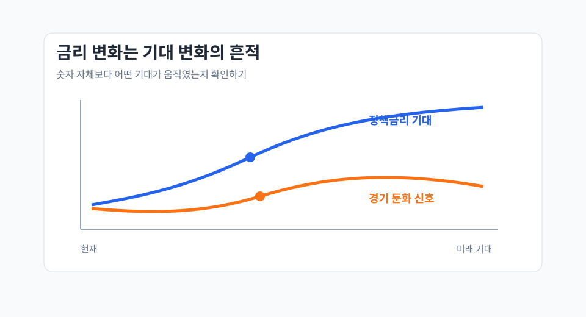

아래 문서는 작성 방식의 한 예시입니다. 실제 발표 문서는 발표자가 공유하기 좋은 흐름에 맞게 다르게 구성해도 됩니다.

## 한 줄 요약

금리는 현재의 경기 지표뿐 아니라 시장이 기대하는 미래 경로를 함께 반영하기 때문에, 기사 속 숫자보다 숫자가 바뀐 이유를 읽는 것이 중요합니다.

## 읽은 기사와 배경

- 기사: 예시 기사 제목을 입력하세요.
- 매체/호수: 예시 매체와 발행일을 입력하세요.
- 핵심 키워드: 기준금리, 인플레이션, 경기 둔화, 시장 기대
- 관련 국가/지역: 미국
- 관련 기관/기업: 연방준비제도
- 관련 지표: 기준금리, 장기금리, 인플레이션율, 고용지표

## 핵심 내용

1. 중앙은행의 발언은 정책 방향 자체보다 시장의 기대를 조정하는 신호로 작동할 수 있습니다.
2. 장단기 금리 차이는 경기 기대와 리스크 선호를 함께 보여주는 지표로 볼 수 있습니다.
3. 같은 금리 상승이라도 성장 기대 때문인지, 인플레이션 우려 때문인지에 따라 해석이 달라집니다.

## 배운 점

- 경제 기사에서 "금리가 올랐다"는 문장은 결과이고, 더 중요한 질문은 "어떤 기대가 바뀌었나"입니다.
- 단일 지표만 보면 해석이 흔들리기 쉬워서 물가, 고용, 채권시장 반응을 함께 봐야 합니다.

## 어려웠던 점

- 기사마다 명목금리, 실질금리, 정책금리를 섞어 쓰는 경우가 있어 맥락을 구분하는 데 시간이 걸렸습니다.
- 시장 기대가 가격에 반영되는 과정을 직관적으로 설명하기가 쉽지 않았습니다.

## 같이 알면 좋은 것

| 개념 | 짧은 설명 |
| --- | --- |
| 기준금리 | 중앙은행이 통화정책 기준으로 삼는 단기 금리 |
| 장기금리 | 성장률, 물가, 위험 프리미엄 기대가 반영된 금리 |
| 수익률 곡선 | 만기별 금리의 형태로 경기 기대를 읽는 데 활용 |

## 토론거리

- 지금 시장은 경기 둔화와 물가 재상승 중 무엇을 더 크게 가격에 반영하고 있을까요?
- 경제 기사에서 숫자보다 표현의 변화가 더 중요한 순간은 언제일까요?
